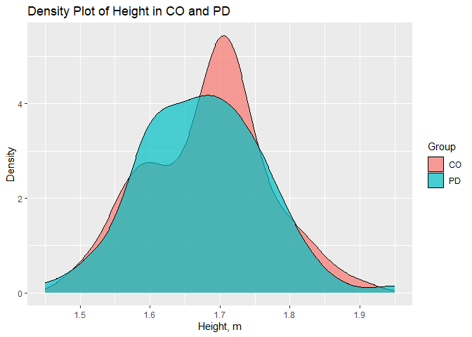
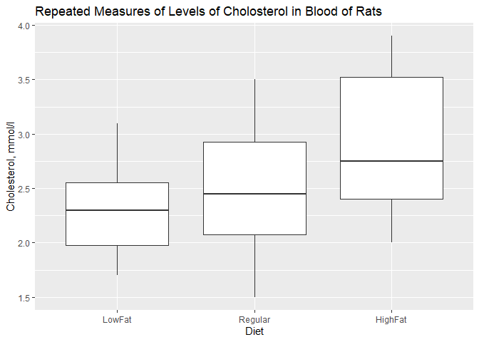

-   [Завдання 1](#завдання-1)
    -   [Отримані результати](#отримані-результати)
-   [Завдання 2](#завдання-2)
    -   [Контроль](#контроль)
    -   [Хвороба Паркінсона](#хвороба-паркінсона)
    -   [Хвороба Гантінгтона](#хвороба-гантінгтона)
    -   [БАС](#бас)
    -   [Отримані результати](#отримані-результати-1)
        -   [Контроль](#контроль-1)
        -   [Хвороба Паркінсона](#хвороба-паркінсона-1)
        -   [Хвороба Гантінгтона](#хвороба-гантінгтона-1)
        -   [БАС](#бас-1)
-   [Завдання 3](#завдання-3)
    -   [Зріст](#зріст)
    -   [TUAG](#tuag)
    -   [Швидкість](#швидкість)
    -   [Результати та висновки зроблені під час
        роботи](#результати-та-висновки-зроблені-під-час-роботи)
-   [Завдання 4](#завдання-4)
    -   [Height](#height)
        -   [Тест Шапіро-Вілка](#тест-шапіро-вілка)
        -   [Тест Левене](#тест-левене)
        -   [Вибір однофакторного багатовибіркового
            тесту](#вибір-однофакторного-багатовибіркового-тесту)
        -   [Критерій Краскера-Воліса](#критерій-краскера-воліса)
    -   [Weight](#weight)
        -   [Тест Шапіро-Вілка](#тест-шапіро-вілка-1)
        -   [Тест Левене](#тест-левене-1)
        -   [Вибір однофакторного багатовибіркового
            тесту](#вибір-однофакторного-багатовибіркового-тесту-1)
        -   [Тест Коновера-Імана](#тест-коновера-імана)
        -   [Leg Length](#leg-length)
        -   [Тест Шапіро-Вілка](#тест-шапіро-вілка-2)
        -   [Тест Левене](#тест-левене-2)
        -   [Вибір однофакторного багатовибіркового
            тесту](#вибір-однофакторного-багатовибіркового-тесту-2)
        -   [Критерій Краскера-Воліса](#критерій-краскера-воліса-1)
    -   [Speed](#speed)
        -   [Тест Шапіро-Вілка](#тест-шапіро-вілка-3)
        -   [Тест Левене](#тест-левене-3)
        -   [Вибір однофакторного багатовибіркового
            тесту](#вибір-однофакторного-багатовибіркового-тесту-3)
        -   [ANOVA](#anova)
    -   [Висновки](#висновки)
-   [Завдання 5](#завдання-5)
    -   [Перевірка на нормальність з використанням тесту
        Шапіро-Вілка](#перевірка-на-нормальність-з-використанням-тесту-шапіро-вілка)
        -   [LowFat](#lowfat)
        -   [Regular](#regular)
        -   [HighFat](#highfat)
    -   [Аналіз сферичності](#аналіз-сферичності)
    -   [Дисперсійний аналіз з повторюваними
        вимірами](#дисперсійний-аналіз-з-повторюваними-вимірами)
    -   [Висновки](#висновки-1)
-   [Завдання 6](#завдання-6)
    -   [Завдання 7](#завдання-7)
    -   [Висновки](#висновки-3)

# Завдання 1

    library(readxl)
    L1 <- read_excel("D:/work_biph/phd/study/stat/stat1_L1/L1.xlsx", 
        col_types = c("text", "text", "numeric", 
            "numeric", "numeric", "text", "numeric", 
            "numeric"))

    ## Warning: Expecting numeric in G37 / R37C7: got 'N/A'

    ## Warning: Expecting numeric in G56 / R56C7: got 'N/A'

    ## Warning: Expecting numeric in G57 / R57C7: got 'N/A'

    ## Warning: Expecting numeric in E65 / R65C5: got 'N/A'

    View(L1)

Спочатку було трошки змінено таблицю: спрощено назви в першому рядку та
додано стовпчик, що вказував на групу, до якої належали пацієнти.

Враховуючи, що у нас в стовпчику “GENDER” присутні текстові дані, даний
стовпчик було переведено в фактор з використанням функції:

    L1$GENDER <- as.factor(L1$GENDER)

Далі з наявного масиву даних ми обирали необхідні нам спостереження, що
належать до однієї експериментальної групи наступним чином:

    control <- L1[which(L1$G=='control'),]
    park <- L1[which(L1$G=='park'),]
    hunt <- L1[which(L1$G=='hunt'),]
    als <- L1[which(L1$G=='als'),]

Надалі з використанням стандартних функцій базового пакету R було
визначено:

-   Для показників з кількісними даними (“AGE”, “HEIGHT”, “WEIGHT”)
    мінімальні значення (Min.); значення, що припадає на 1-й квартиль
    (1st Qu.); медіана (Median); середнє арифметичне (Mean); значення,
    що припадає на 3-й квартиль (3rd Qu.); максимальне значення (Max.);
    кількість значень, що були упущені при проведенні дослідження
    (NA\`s);

-   Для фактору “GENDER”: кількість значень, що характеризують стать
    (“f”, “m”).  

Стовпчики “SPEED” та “SEVERITY” не бралися до уваги. Дані показники було
визначено наступним чином:

    summary(control)

    ##       G                GROUP                AGE            HEIGHT     
    ##  Length:16          Length:16          Min.   :20.00   Min.   :1.670  
    ##  Class :character   Class :character   1st Qu.:22.00   1st Qu.:1.780  
    ##  Mode  :character   Mode  :character   Median :35.00   Median :1.830  
    ##                                        Mean   :39.31   Mean   :1.833  
    ##                                        3rd Qu.:53.25   3rd Qu.:1.893  
    ##                                        Max.   :74.00   Max.   :1.940  
    ##      WEIGHT      GENDER     SPEED          SEVERITY
    ##  Min.   :50.00   f:14   Min.   :0.910   Min.   :0  
    ##  1st Qu.:59.00   m: 2   1st Qu.:1.312   1st Qu.:0  
    ##  Median :65.00          Median :1.330   Median :0  
    ##  Mean   :66.81          Mean   :1.354   Mean   :0  
    ##  3rd Qu.:70.75          3rd Qu.:1.470   3rd Qu.:0  
    ##  Max.   :95.00          Max.   :1.540   Max.   :0

    summary(park)

    ##       G                GROUP                AGE           HEIGHT    
    ##  Length:15          Length:15          Min.   :44.0   Min.   :1.67  
    ##  Class :character   Class :character   1st Qu.:58.5   1st Qu.:1.72  
    ##  Mode  :character   Mode  :character   Median :68.0   Median :1.92  
    ##                                        Mean   :66.8   Mean   :1.87  
    ##                                        3rd Qu.:75.5   3rd Qu.:2.00  
    ##                                        Max.   :80.0   Max.   :2.13  
    ##      WEIGHT       GENDER     SPEED           SEVERITY   
    ##  Min.   : 43.00   f: 5   Min.   :0.5000   Min.   :1.50  
    ##  1st Qu.: 62.00   m:10   1st Qu.:0.9100   1st Qu.:2.00  
    ##  Median : 77.00          Median :0.9800   Median :3.00  
    ##  Mean   : 75.07          Mean   :0.9993   Mean   :2.80  
    ##  3rd Qu.: 86.00          3rd Qu.:1.1200   3rd Qu.:3.25  
    ##  Max.   :100.00          Max.   :1.3300   Max.   :4.00

    summary(hunt)

    ##       G                GROUP                AGE            HEIGHT    
    ##  Length:20          Length:20          Min.   :29.00   Min.   :1.57  
    ##  Class :character   Class :character   1st Qu.:36.00   1st Qu.:1.78  
    ##  Mode  :character   Mode  :character   Median :44.50   Median :1.82  
    ##                                        Mean   :46.65   Mean   :1.83  
    ##                                        3rd Qu.:54.00   3rd Qu.:1.89  
    ##                                        Max.   :71.00   Max.   :2.00  
    ##                                                                      
    ##      WEIGHT       GENDER     SPEED          SEVERITY    
    ##  Min.   : 45.00   f:14   Min.   :0.560   Min.   : 1.00  
    ##  1st Qu.: 58.00   m: 6   1st Qu.:1.015   1st Qu.: 3.75  
    ##  Median : 73.50          Median :1.190   Median : 8.00  
    ##  Mean   : 72.05          Mean   :1.149   Mean   : 6.90  
    ##  3rd Qu.: 85.75          3rd Qu.:1.330   3rd Qu.:10.25  
    ##  Max.   :102.00          Max.   :1.820   Max.   :12.00  
    ##                          NA's   :1

    summary(als)

    ##       G                GROUP                AGE            HEIGHT     
    ##  Length:13          Length:13          Min.   :36.00   Min.   :1.570  
    ##  Class :character   Class :character   1st Qu.:43.00   1st Qu.:1.700  
    ##  Mode  :character   Mode  :character   Median :62.00   Median :1.750  
    ##                                        Mean   :55.62   Mean   :1.745  
    ##                                        3rd Qu.:66.00   3rd Qu.:1.830  
    ##                                        Max.   :70.00   Max.   :1.880  
    ##                                                                       
    ##      WEIGHT       GENDER     SPEED           SEVERITY    
    ##  Min.   : 40.82   f: 3   Min.   :0.7700   Min.   : 1.00  
    ##  1st Qu.: 61.24   m:10   1st Qu.:0.8425   1st Qu.: 7.00  
    ##  Median : 78.02          Median :1.0850   Median :13.00  
    ##  Mean   : 77.11          Mean   :1.0541   Mean   :18.31  
    ##  3rd Qu.: 84.48          3rd Qu.:1.2510   3rd Qu.:17.00  
    ##  Max.   :117.50          Max.   :1.3020   Max.   :54.00  
    ##  NA's   :1               NA's   :2

Паралельно було додано бібліотеку pastecs з використанням функції:

    library(pastecs)

    stat.desc(control)

    ##           G GROUP         AGE       HEIGHT       WEIGHT GENDER       SPEED
    ## nbr.val  NA    NA  16.0000000 16.000000000   16.0000000     NA 16.00000000
    ## nbr.null NA    NA   0.0000000  0.000000000    0.0000000     NA  0.00000000
    ## nbr.na   NA    NA   0.0000000  0.000000000    0.0000000     NA  0.00000000
    ## min      NA    NA  20.0000000  1.670000000   50.0000000     NA  0.91000000
    ## max      NA    NA  74.0000000  1.940000000   95.0000000     NA  1.54000000
    ## range    NA    NA  54.0000000  0.270000000   45.0000000     NA  0.63000000
    ## sum      NA    NA 629.0000000 29.320000000 1069.0000000     NA 21.67000000
    ## median   NA    NA  35.0000000  1.830000000   65.0000000     NA  1.33000000
    ## mean     NA    NA  39.3125000  1.832500000   66.8125000     NA  1.35437500
    ## SE.mean  NA    NA   4.6284615  0.020176306    2.7692038     NA  0.04004132
    ## CI.mean  NA    NA   9.8653323  0.043004779    5.9024181     NA  0.08534605
    ## var      NA    NA 342.7625000  0.006513333  122.6958333     NA  0.02565292
    ## std.dev  NA    NA  18.5138462  0.080705225   11.0768151     NA  0.16016528
    ## coef.var NA    NA   0.4709404  0.044041050    0.1657896     NA  0.11825771
    ##          SEVERITY
    ## nbr.val        16
    ## nbr.null       16
    ## nbr.na          0
    ## min             0
    ## max             0
    ## range           0
    ## sum             0
    ## median          0
    ## mean            0
    ## SE.mean         0
    ## CI.mean         0
    ## var             0
    ## std.dev         0
    ## coef.var      NaN

    stat.desc(park)

    ##           G GROUP          AGE      HEIGHT      WEIGHT GENDER       SPEED
    ## nbr.val  NA    NA   15.0000000 15.00000000   15.000000     NA 15.00000000
    ## nbr.null NA    NA    0.0000000  0.00000000    0.000000     NA  0.00000000
    ## nbr.na   NA    NA    0.0000000  0.00000000    0.000000     NA  0.00000000
    ## min      NA    NA   44.0000000  1.67000000   43.000000     NA  0.50000000
    ## max      NA    NA   80.0000000  2.13000000  100.000000     NA  1.33000000
    ## range    NA    NA   36.0000000  0.46000000   57.000000     NA  0.83000000
    ## sum      NA    NA 1002.0000000 28.05000000 1126.000000     NA 14.99000000
    ## median   NA    NA   68.0000000  1.92000000   77.000000     NA  0.98000000
    ## mean     NA    NA   66.8000000  1.87000000   75.066667     NA  0.99933333
    ## SE.mean  NA    NA    2.8017002  0.03924283    4.362684     NA  0.05222175
    ## CI.mean  NA    NA    6.0090492  0.08416751    9.357028     NA  0.11200451
    ## var      NA    NA  117.7428571  0.02310000  285.495238     NA  0.04090667
    ## std.dev  NA    NA   10.8509381  0.15198684   16.896604     NA  0.20225397
    ## coef.var NA    NA    0.1624392  0.08127639    0.225088     NA  0.20238889
    ##            SEVERITY
    ## nbr.val  15.0000000
    ## nbr.null  0.0000000
    ## nbr.na    0.0000000
    ## min       1.5000000
    ## max       4.0000000
    ## range     2.5000000
    ## sum      42.0000000
    ## median    3.0000000
    ## mean      2.8000000
    ## SE.mean   0.2225395
    ## CI.mean   0.4772997
    ## var       0.7428571
    ## std.dev   0.8618916
    ## coef.var  0.3078184

    stat.desc(hunt)

    ##           G GROUP         AGE      HEIGHT       WEIGHT GENDER       SPEED
    ## nbr.val  NA    NA  20.0000000 20.00000000   20.0000000     NA 19.00000000
    ## nbr.null NA    NA   0.0000000  0.00000000    0.0000000     NA  0.00000000
    ## nbr.na   NA    NA   0.0000000  0.00000000    0.0000000     NA  1.00000000
    ## min      NA    NA  29.0000000  1.57000000   45.0000000     NA  0.56000000
    ## max      NA    NA  71.0000000  2.00000000  102.0000000     NA  1.82000000
    ## range    NA    NA  42.0000000  0.43000000   57.0000000     NA  1.26000000
    ## sum      NA    NA 933.0000000 36.60000000 1441.0000000     NA 21.84000000
    ## median   NA    NA  44.5000000  1.82000000   73.5000000     NA  1.19000000
    ## mean     NA    NA  46.6500000  1.83000000   72.0500000     NA  1.14947368
    ## SE.mean  NA    NA   2.8165629  0.02367544    3.8116684     NA  0.07999442
    ## CI.mean  NA    NA   5.8951338  0.04955326    7.9779136     NA  0.16806204
    ## var      NA    NA 158.6605263  0.01121053  290.5763158     NA  0.12158304
    ## std.dev  NA    NA  12.5960520  0.10587977   17.0462992     NA  0.34868760
    ## coef.var NA    NA   0.2700118  0.05785780    0.2365899     NA  0.30334544
    ##             SEVERITY
    ## nbr.val   20.0000000
    ## nbr.null   0.0000000
    ## nbr.na     0.0000000
    ## min        1.0000000
    ## max       12.0000000
    ## range     11.0000000
    ## sum      138.0000000
    ## median     8.0000000
    ## mean       6.9000000
    ## SE.mean    0.8580885
    ## CI.mean    1.7959998
    ## var       14.7263158
    ## std.dev    3.8374882
    ## coef.var   0.5561577

    stat.desc(als)

    ##           G GROUP         AGE       HEIGHT      WEIGHT GENDER       SPEED
    ## nbr.val  NA    NA  13.0000000 13.000000000  12.0000000     NA 11.00000000
    ## nbr.null NA    NA   0.0000000  0.000000000   0.0000000     NA  0.00000000
    ## nbr.na   NA    NA   0.0000000  0.000000000   1.0000000     NA  2.00000000
    ## min      NA    NA  36.0000000  1.570000000  40.8200000     NA  0.77000000
    ## max      NA    NA  70.0000000  1.880000000 117.5000000     NA  1.30200000
    ## range    NA    NA  34.0000000  0.310000000  76.6800000     NA  0.53200000
    ## sum      NA    NA 723.0000000 22.683000000 925.3800000     NA 11.59500000
    ## median   NA    NA  62.0000000  1.750000000  78.0200000     NA  1.08500000
    ## mean     NA    NA  55.6153846  1.744846154  77.1150000     NA  1.05409091
    ## SE.mean  NA    NA   3.5581947  0.026392464   6.1053641     NA  0.06570975
    ## CI.mean  NA    NA   7.7526403  0.057504238  13.4378157     NA  0.14641046
    ## var      NA    NA 164.5897436  0.009055308 447.3056455     NA  0.04749549
    ## std.dev  NA    NA  12.8292534  0.095159380  21.1496015     NA  0.21793460
    ## coef.var NA    NA   0.2306781  0.054537404   0.2742605     NA  0.20675124
    ##             SEVERITY
    ## nbr.val   13.0000000
    ## nbr.null   0.0000000
    ## nbr.na     0.0000000
    ## min        1.0000000
    ## max       54.0000000
    ## range     53.0000000
    ## sum      238.0000000
    ## median    13.0000000
    ## mean      18.3076923
    ## SE.mean    4.9414970
    ## CI.mean   10.7665970
    ## var      317.4391026
    ## std.dev   17.8168208
    ## coef.var   0.9731877

## Отримані результати

-   Контрольна група складається з 16 пацієнтів. Вік в контрольній групі
    від 20 до 74 років, при цьому середній вік пацієнтів 39 років а
    медіанний вік становить 35 років. Зріст варіюється від 1.67 до 1.94
    метра, і середнє значення становить 1.83 ± 0.08 метра, медіанний
    зріст становить 1.83 метра; стандартна похибка для даного показника
    становить 0.02, коефіцієнт варіації – 0.04. Вага пацієнтів
    розподілена в діапазоні від 50 до 95 кілограмів, і середнє значення
    складає 66.81 ± 11.08 кілограма, медіана – 65.00 кг; стандартна
    похибка становить 2.80 , коефіцієнт варіації 0.17. У групі
    переважають жінки (14 осіб) порівняно з чоловіками (2 особи).

-   Друга група, пацієнтів хворих на хворобу Паркінсона, складається з
    15 пацієнтів. Вік в даній групі від 44 до 80 років, при цьому
    середній вік пацієнтів 67 років, медіанний вік становить 68 років.
    Зріст варіюється від 1.67 до 2.13 метра, середній зріст становить
    1.87 ± 0.15 метра, тоді як медіанний зріст становить 1.92 метра;
    стандатна похибка для даного показника становить 0.04, коефіцієнт
    варіації – 0.08. Вага пацієнтів розподілена в діапазоні від 43 до
    100 кілограмів, в середньому 75.06 ± 16.90 кілограма, медіана –
    77.00 кг; стандартна похибка становить 4.36, коефіцієнт варіації
    0.26. У групі переважають чоловіки (10 осіб) порівняно з жінками (5
    осіб).

-   Третя група складається з 20 пацієнтів хворих на хворобу
    Гантінгтона. Середній вік в даній групі становить 47 років, при тому
    що вік в даній групі має діапазон від 29 до 71 років, медіанний вік
    становить 44.5 років. Зріст варіюється від 1.57 до 2.00 метра, і
    середнє значення становить 1.83 ± 0.11 метра, медіанний зріст
    становить 1.82 метра; стандартна похибка для даного показника
    становить 0.02, коефіцієнт варіації – 0.06. Вага пацієнтів варіює
    від 45 до 102 кілограмів, і середнє значення складає 72.05 ± 17.04
    кілограма, медіанна вага складає 73.50 кг; стандартна похибка
    становить 3.81, коефіцієнт варіації 0.24. У групі переважають жінки
    (14 осіб) порівняно з чоловіками (6 особи).

-   Група хворих на бічний аміотрофічний склероз складалась з 3
    пацієнтів, в якій кількісно переважали чоловіки (10 осіб) над
    жінками (3 особи). Пацієнти мали вік від 36 до 70 років, середній
    вік пацієнтів становив 56 років, медіанний – 62. Зріст пацієнтів був
    в проміжку від 1.57 до 1.88 метра, середнє значення складає 1.74 ±
    0.10 метра, медіана – 1.75 метра; стандартна похибка становила 0.03,
    коефіцієнт варіації – 0.05. Вага була невідома для одного пацієнта,
    але грунтуючись на даних, відомих для інших 12 пацієнтів можна
    сказати, що їх вага варіює в діапазоні між 40.82 та 117.50 кг,
    середня вага становить 77.12 ± 21.14 кг, медіанна – 78.02 кг;
    стандартна похибка становить 6.11, коефіцієнт варіації – 0.27.  

# Завдання 2

Для початку було імпортовано таблицю, що містить наступні зміни:
спрощені назви в першому рядку; доданий стовпчик, в якому вказана група
до якого належить пацієнт; змінений тип даних на “numeric”в стовпчиках,
які цього потребують (“AGE”, “HEIGHT”, “WEIGHT”, “SPEED” та “SEVERITY”).

Загалом, в таблиці представлені дані 64 осіб, що поділено на 4 групи:
контрольна (“control”), хворі на хворобу Паркінсона (“park”), хворобу
Гантінгтона (“hunt”) та бічний аміотрофічний склероз (БАС, “als”). Під
час імпорту даних було виявлено, що в стовпчику “WEIGHT” випадає одне
значення для пацієнта з БАС, тоді як в “SPEED” є три значення, що
випадають в групах хворих на хвороби Гантінгтона (для 1-го пацієнта) та
БАС (для 2-х пацієнтів).

## Контроль

Далі аналізували дані по групам. Спочатку було розділено наявний датасет
на 4 піддатасети. Дані групи “control” від інших груп було відокремлено
наступним чином:

    control <- L1[which(L1$G=='control'),]

До групи “control” входять 16 осіб. В межах даної групи в стовпчиках
“HEIGHT”, “WEIGHT” “SPEED” всі необхідні дані присутні.

Було створено гістограми з використанням функції hist():

    hist(control$SPEED)

Візуально аналізуючи утворені гістограми можна стверджувати, що для
даних в групі “control”, показника “SPEED” характерний нормальний
розподіл даних.

    hist(control$HEIGHT)

Візуально аналізуючи утворені гістограми можна стверджувати, що для
даних в групі “control”, показника “HEIGHT” нормальний розподіл даних
відсутній.

    hist(control$WEIGHT)

Візуально аналізуючи утворені гістограми можна стверджувати, що для
даних в групі “control”, показника “WEIGHT” нормальний розподіл даних
відсутній.

Далі були створені графіки з використанням функції qqPlot() з пакету
“car” для порівняння емпіричного та нормального розподілів:

    library(car)

    ## Loading required package: carData

    qqPlot(control$SPEED)

    ## [1] 11  4

Аналізуючи Q-Q plot, побудований на основі даних, що знаходяться в
стовпчику “SPEED”, можна припустити, що твердження, побудоване на основі
гістограми розподілу даних, побудованого в попередньому кроці, щодо того
що дані розподіляються нормально, все ж таки може бути дійсним.

    qqPlot(control$HEIGHT)

    ## [1] 10 11

Аналізуючи Q-Q plot, побудований на основі даних, що знаходяться в
стовпчику “HEIGHT”, можна припустити, що твердження, побудоване на
основі гістограми розподілу даних, побудованого в попередньому кроці,
щодо того що дані розподіляються нормально, все ж таки може бути хибним.

    qqPlot(control$WEIGHT)

    ## [1]  1 15

Аналізуючи Q-Q plot, побудований на основі даних, що знаходяться в
стовпчику “WEIGHT”, можна припустити, що твердження, побудоване на
основі гістограми розподілу даних, побудованого в попередньому кроці,
щодо того що дані розподіляються нормально, як і в попередньому випадку,
може бути хибним.

Проте дані твердження потребують подальшої перевірки, з використанням
критерію Шапіро-Вілка:

    shapiro.test(control$SPEED)

    ## 
    ##  Shapiro-Wilk normality test
    ## 
    ## data:  control$SPEED
    ## W = 0.87561, p-value = 0.03318

У результаті тесту Шапіро-Вілка було виявлено, що для даних в колонці
“SPEED” критерій W = 0,875, p = 0,033. Якщо для того, щоб прийняти
нульову гіпотезу про те, що у нас присутній нормальний розподіл даних за
рівня значущості p ≥ 0,05, то можемо стверджувати, що в колонці “SPEED”,
попри всі припущення створені на основі побудованих гістограми та Q-Q
графіку, нормальний розподіл даних відсутній.

    shapiro.test(control$HEIGHT)

    ## 
    ##  Shapiro-Wilk normality test
    ## 
    ## data:  control$HEIGHT
    ## W = 0.95397, p-value = 0.555

У результаті тесту Шапіро-Вілка було виявлено, що для даних в колонці
“HEIGHT” критерій W = 0,953, p = 0,555. Якщо для того, щоб прийняти
нульову гіпотезу про те, що у нас присутній нормальний розподіл даних за
рівня значущості p ≥ 0,05, то можемо стверджувати, що в колонці “HEIGHT”
присутній нормальний розподіл даних.

    shapiro.test(control$WEIGHT)

    ## 
    ##  Shapiro-Wilk normality test
    ## 
    ## data:  control$WEIGHT
    ## W = 0.93157, p-value = 0.2581

У результаті тесту Шапіро-Вілка було виявлено, що для даних в колонці
“WEIGHT” критерій W = 0,931, p = 0,258. Якщо для того, щоб прийняти
нульову гіпотезу про те, що у нас присутній нормальний розподіл даних за
рівня значущості p ≥ 0,05, то можемо стверджувати, що в колонці “WEIGHT”
присутній нормальний розподіл даних.

## Хвороба Паркінсона

Далі було проаналізовано результати тесту ходи та ступінь розвитку
захворювання для пацієнтів, що мають хворобу Паркінсона. Дані групи
“park” від інших груп було відокремлено наступним чином:

    park <- L1[which(L1$G=='park'),]

В групу “park” входить 15 осіб, хворих на хворобу Паркінсона. Жодне з
значень в стовпчиках, що необхідні для подальшого аналізу, не було
випущено.

Для початку з використанням функції hist() були створені гістограми для
значень в колонках “SPEED” та отримано наступні графіки:

    hist(park$SPEED)

    hist(park$HEIGHT)

Спираючись на візуальну оцінку, здається, що в колонці “HEIGHT” дані
нормально не розподілені.

    hist(park$WEIGHT)

Спираючись на візуальну оцінку, здається, що в колонці “WEIGHT” дані
нормально не розподілені.

Далі були створені з використанням функції qqPlot() наступні графіки:

    qqPlot(park$SPEED)

    ## [1] 11  6

Графіки, що були утворені в результаті використання вищезгаданої
функції, викликали сумніви, щодо коректності попереднього припущення.
Таким чином, на основі Q-Q plot можна допустити, що дані розподілені
нормально.

    qqPlot(park$HEIGHT)

    ## [1] 14  2

Графіки, що були утворені в результаті використання вищезгаданої
функції, викликали сумніви, щодо коректності попереднього припущення.
Таким чином, на основі Q-Q plot можна допустити, що дані розподілені
нормально.

    qqPlot(park$WEIGHT)

    ## [1]  4 11

Графіки, що були утворені в результаті використання вищезгаданої
функції, викликали сумніви, щодо коректності попереднього припущення.
Таким чином, на основі Q-Q plot можна допустити, що дані розподілені
нормально.

Для того, щоб впевнитися, який же розподіл даних, що нас цікавлять в
групі “park” та чи приймаємо ми нульову теорію, що полягає в тому, що
наші дані розподілені нормально, було проведено тест Шапіро-Вілка:

    shapiro.test(park$SPEED)

    ## 
    ##  Shapiro-Wilk normality test
    ## 
    ## data:  park$SPEED
    ## W = 0.93381, p-value = 0.3108

Відповідно до результатів тесту, критерій, обрахований на основі даних в
колонці “SPEED” становить W = 0,933, p = 0,310. Враховуючи, що р ≥ 0,05,
то можна стверджувати, що для значень “SPEED” групи “park” притаманний
нормальний розподіл даних.

    shapiro.test(park$HEIGHT)

    ## 
    ##  Shapiro-Wilk normality test
    ## 
    ## data:  park$HEIGHT
    ## W = 0.91816, p-value = 0.1806

Відповідно до результатів тесту, критерій, обрахований на основі даних в
колонці “HEIGHT” становить W = 0,918, p = 0,180. Враховуючи, що р ≥
0,05, то можна стверджувати, що для значень “HEIGHT” групи “park”
притаманний нормальний розподіл даних.

    shapiro.test(park$WEIGHT)

    ## 
    ##  Shapiro-Wilk normality test
    ## 
    ## data:  park$WEIGHT
    ## W = 0.95511, p-value = 0.6081

Відповідно до результатів тесту, критерій, обрахований на основі даних в
колонці “WEIGHT” становить W = 0,955, p = 0,608. Враховуючи, що р ≥
0,05, то можна стверджувати, що для значень “WEIGHT” групи “park”
притаманний нормальний розподіл даних.

## Хвороба Гантінгтона

Далі було проаналізовано результати тесту ходи та ступінь розвитку
захворювання для пацієнтів, що мають хворобу Гантінгтона. Дані групи
“hunt” від інших груп було відокремлено наступним чином:

    hunt <- L1[which(L1$G=='hunt'),]

В групу “hunt” входить 20 осіб, хворих на хворобу Гантінгтона. Було
виявлено, що одне зі значень в колонці “SPEED” було випущено.

Було створено гістограми з використанням функції hist():

    hist(hunt$SPEED)

Спираючись на візуальну оцінку, здається, що в колонці “SPEED” дані
нормально розподілені.

    hist(hunt$HEIGHT)

Спираючись на візуальну оцінку, здається, що в колонці “HEIGHT” дані
нормально не розподілені.

    hist(hunt$WEIGHT)

Спираючись на візуальну оцінку, здається, що в колонці “WEIGHT” дані
нормально розподілені.

Далі були створені з використанням функції qqPlot() наступні графіки:

    qqPlot(hunt$SPEED)

    ## [1]  5 13

Створений графік підтверджує попереднє припущення про те, що в стовпчику
“SPEED” присутній нормальний розподіл даних.

    qqPlot(hunt$HEIGHT)

    ## [1] 20  5

Створений графік не підтверджує попереднє припущення про те, що в
стовпчику “HEIGHT” не присутній нормальний розподіл даних.

    qqPlot(hunt$WEIGHT)

    ## [1] 10 20

Створений графік підтверджує попереднє припущення про те, що в стовпчику
“WEIGHT” присутній нормальний розподіл даних.

Але всяке припущення має пройти певну перевірку для того щоб стати
ствердженням, тому використовуємо тест Шапіро-Вілка, на основі якого ми
або приймемо, або відкинемо нульову гіпотезу щодо нормальності розподілу
даних:

    shapiro.test(hunt$SPEED)

    ## 
    ##  Shapiro-Wilk normality test
    ## 
    ## data:  hunt$SPEED
    ## W = 0.94405, p-value = 0.3116

У результаті тесту на нормальність Шапіро-Вілка, було виявлено, що для
стовпчика “SPEED” W = 0,944, р = 0,311. Враховуючи, що представлені дані
вважаються нормальними за рівня значущості 0,311, що є більшим за 0,05,
в даному випадку ми приймаємо нульову гіпотезу.

    shapiro.test(hunt$HEIGHT)

    ## 
    ##  Shapiro-Wilk normality test
    ## 
    ## data:  hunt$HEIGHT
    ## W = 0.95704, p-value = 0.4866

У результаті тесту на нормальність Шапіро-Вілка, було виявлено, що для
стовпчика “HEIGHT” W = 0,957, р = 0,486. Враховуючи, що представлені
дані вважаються нормальними за рівня значущості 0,486, що є більшим за
0,05, в даному випадку ми приймаємо нульову гіпотезу.

    shapiro.test(hunt$WEIGHT)

    ## 
    ##  Shapiro-Wilk normality test
    ## 
    ## data:  hunt$WEIGHT
    ## W = 0.95714, p-value = 0.4884

У результаті тесту на нормальність Шапіро-Вілка, було виявлено, що для
стовпчика “WEIGHT” W = 0,957, р = 0,488. Враховуючи, що представлені
дані вважаються нормальними за рівня значущості 0,488, що є більшим за
0,05, в даному випадку ми приймаємо нульову гіпотезу.

## БАС

І наостанок було проаналізовано результати тесту ходи та ступінь
розвитку захворювання для пацієнтів, що мають БАС. Дані групи “als” від
інших груп було відокремлено наступним чином:

    als <- L1[which(L1$G=='als'),]

В групу “als” входить 13 осіб, хворих на БАС. Було виявлено, що два
значення в колонці “SPEED” було випущено, а в колонці “WEIGHT” - одне.

Для початку з використанням функції hist() були створені гістограми для
значень в колонках “SPEED” та отримано наступні графіки:

    hist(als$SPEED)

Візуально аналізуючи утворені гістограми можна стверджувати, що для
даних в групі “als” для показника “SPEED” нормальний розподіл даних
відсутній.

    hist(als$HEIGHT)

Візуально аналізуючи утворені гістограми можна стверджувати, що для
даних в групі “als” для показника “HEIGHT” нормальний розподіл даних
відсутній.

    hist(als$WEIGHT)

Візуально аналізуючи утворені гістограми можна стверджувати, що для
даних в групі “als” для показника “WEIGHT” нормальний розподіл даних
присутній.

Далі були створені графіки з використанням функції qqPlot() з пакету
“car” для порівняння емпіричного та нормального розподілів:

    qqPlot(als$SPEED)

    ## [1] 6 1

Аналізуючи Q-Q plot, побудований на основі даних, що знаходяться в
стовпчику “SPEED”, можна припустити, що твердження, побудоване на основі
гістограми розподілу даних, побудованого в попередньому кроці, щодо того
що дані не розподіляються нормально, все ж таки може бути дійсним.

    qqPlot(als$HEIGHT)

    ## [1] 3 9

Аналізуючи Q-Q plot, побудований на основі даних, що знаходяться в
стовпчику “HEIGHT”, можна припустити, що твердження, побудоване на
основі гістограми розподілу даних, побудованого в попередньому кроці,
щодо того що дані не розподіляються нормально, все ж таки може бути
хибним.

    qqPlot(als$WEIGHT)

    ## [1] 12  3

Аналізуючи Q-Q plot, побудований на основі даних, що знаходяться в
стовпчику “WEIGHT”, можна припустити, що твердження, побудоване на
основі гістограми розподілу даних, побудованого в попередньому кроці,
щодо того що дані розподіляються нормально, все ж таки може бути вірним.
Проте дані твердження потребують подальшої перевірки з використанням
критерію Шапіро-Вілка:

    shapiro.test(als$SPEED)

    ## 
    ##  Shapiro-Wilk normality test
    ## 
    ## data:  als$SPEED
    ## W = 0.8377, p-value = 0.02946

У результаті проведення тесту Шапіро-Вілка було виявлено, що для
стовпчика “SPEED” W = 0,837, р = 0,029. Враховуючи, що ми приймаємо
нульову гіпотезу щодо нормальності розподілу даних за p ≥ 0,05, можна
стверджувати, що в даних нормальний розподіл відсутній.

    shapiro.test(als$HEIGHT)

    ## 
    ##  Shapiro-Wilk normality test
    ## 
    ## data:  als$HEIGHT
    ## W = 0.92379, p-value = 0.2821

У результаті проведення тесту Шапіро-Вілка було виявлено, що для
стовпчика “HEIGHT” W = 0,923, р = 0,282. Враховуючи, що ми приймаємо
нульову гіпотезу щодо нормальності розподілу даних за p ≥ 0,05, можна
стверджувати, що в даних нормальний розподіл присутній.

    shapiro.test(als$WEIGHT)

    ## 
    ##  Shapiro-Wilk normality test
    ## 
    ## data:  als$WEIGHT
    ## W = 0.96409, p-value = 0.8402

У результаті проведення тесту Шапіро-Вілка було виявлено, що для
стовпчика “WEIGHT” W = 0,964, р = 0,840. Враховуючи, що ми приймаємо
нульову гіпотезу щодо нормальності розподілу даних за p ≥ 0,05, можна
стверджувати, що в даних нормальний розподіл присутній.  

## Отримані результати

### Контроль

-   Аналізуючи гістограми, було виявлено, що для даних у групі “control”
    показник “SPEED” проявляє нормальний розподіл. Аналізуючи Q-Q графік
    для “SPEED”, було припущено, що дані можуть мати нормальний
    розподіл.

-   Результати тесту Шапіро-Вілка підтверджують альтернативну гіпотезу
    для “SPEED”: критерій W дорівнює 0,875, p = 0,033, що вказує на
    відхилення від нормального розподілу, оскільки p &lt; 0,05.

-   Аналізуючи гістограму для даних у групі “control” показника
    “HEIGHT”, було припущено, що вона не вказує на наявність нормального
    розподілу даних. При огляді Q-Q графіку, побудованого на основі
    значень у стовпчику “HEIGHT”, було припущено, що твердження про
    відсутність нормального розподілу, зроблене на підставі гістограми,
    може бути невірним.

-   Результати тесту Шапіро-Вілка показали, що для даних у стовпчику
    “HEIGHT” критерій W = 0,953, p = 0,555. При врахуванні рівня
    значущості p ≥ 0,05, було виявлено, що у стовпчику “HEIGHT”
    спостерігається нормальний розподіл даних.

-   Дивлячись на гістограму для даних у групі “контроль” показника
    “WEIGHT”, було припущено, що вона не вказує на наявність нормального
    розподілу даних. При аналізі Q-Q графіку, побудованого на основі
    значень у стовпчику “WEIGHT”, так само, як і в попередньому випадку,
    було припущено, що твердження про нормальний розподіл, зроблене на
    підставі гістограми, може бути хибним.

-   Результати тесту Шапіро-Вілка показали, що для даних у стовпчику
    “WEIGHT” критерій W = 0,931, p = 0,258. З урахуванням рівня
    значущості p ≥ 0,05, було виявлено, що у стовпчику “WEIGHT”
    спостерігається нормальний розподіл даних.

### Хвороба Паркінсона

-   Базуючись на візуальній оцінці гістограм, виникло враження, що дані
    в колонці “SPEED” не мають нормального розподілу. Графіки,
    сформовані за допомогою функції qqPlot(), викликали сумніви щодо
    вірності початкового припущення. Таким чином, було зроблено нове
    припущення, що дані розподілені нормально.

-   Згідно з результатами тесту, критерій Шапіро-Вілка розрахований для
    “SPEED”, становить W = 0,933, p = 0,310. Оскільки p ≥ 0,05, можна
    стверджувати, що у значень показника “SPEED” у групі “park” наявний
    нормальний розподіл даних.

-   Спираючись на візуальну оцінку гістограми, було припущено, що в
    колонці “HEIGHT” дані нормально не розподілені. В результаті аналізу
    Q-Q графіка було припущено, що дані можуть мати нормальний розподіл.

-   Результати тесту Шапіро-Вілка для колонки “HEIGHT” показали, що
    критерій W = 0,918, p = 0,180. З урахуванням рівня значущості p ≥
    0,05, було прийдено до висновку, що для значень “HEIGHT” у групі
    “park” спостерігається нормальний розподіл.

-   Оцінюючи візуально гістограми було припущено, що в колонці “WEIGHT”
    ймовірно відсутній нормальний розподіл даних. На противагу, аналіз
    Q-Q графіка було припущено, що дані можуть мати нормальний розподіл.

-   Результати тесту Шапіро-Вілка для колонки “WEIGHT” показали, що
    критерій W = 0,955, p = 0,608. З урахуванням рівня значущості p ≥
    0,05, можна зробити висновок, що для значень “WEIGHT” у групі “park”
    спостерігається нормальний розподіл.

### Хвороба Гантінгтона

-   Після візуальної оцінки гістограм виникло припущення, що дані у
    колонці “SPEED” мають нормальний розподіл. Створені Q-Q графіки
    підтвердили припущення щодо наявності нормального розподілу даних у
    “SPEED”.

-   Результати тесту на нормальність Шапіро-Вілка для “SPEED” показали,
    що W = 0,944, p = 0,311. Оскільки значення p ≥ 0,311 перевищує
    рівень значущості 0,05, у цьому випадку ми приймаємо нульову
    гіпотезу про нормальний розподіл даних.

-   Оцінюючи візуально гістограми було припущено, що в колонці “HEIGHT”
    дані можливо не мають нормального розподілу. Q-Q графік, створений
    на основі даних, не підтвердив попереднє припущення про відсутність
    нормального розподілу у стовпчику “HEIGHT”.

-   У результаті тесту на нормальність Шапіро-Вілка, було виявлено, що
    для стовпчика “HEIGHT” W = 0,957, р = 0,486. Враховуючи, що
    представлені дані вважаються нормальними за рівня значущості 0,486,
    що є більшим за 0,05, в даному випадку ми приймаємо нульову
    гіпотезу.

-   Глядаючи на візуальні дані, було припущено, що в колонці “WEIGHT”
    дані ймовірно мають нормальний розподіл. Q-Q графік підтверджує
    наявність нормального розподілу у стовпчику “WEIGHT”.

-   Результати тесту на нормальність Шапіро-Вілка для стовпчика “WEIGHT”
    показали, що W = 0,957, p = 0,488. З урахуванням того, що значення p
    = 0,488, що перевищує рівень значущості 0,05, було прийнято нульову
    гіпотезу про наявність нормального розподілу даних.

### БАС

-   Аналізуючи гістограми, було припущено, що для числових даних у групі
    “als”, як для “SPEED” нормальний розподіл відсутній. При аналізі Q-Q
    plot, побудованого на основі “SPEED”, можна припустити, що
    ствердження, зроблене на підставі гістограми розподілу даних у
    попередньому етапі, що дані не розподіляються нормально, може бути
    вірним.

-   У результаті тесту Шапіро-Вілка для “SPEED” було виявлено, що W =
    0,837, p = 0,029. Враховуючи, що ми приймаємо нульову гіпотезу про
    нормальність розподілу даних за умови p ≥ 0,05, можна стверджувати,
    що для показника “SPEED” в групі “als” нормальний розподіл
    відсутній.

-   Візуальний аналіз утворених гістограм можна стверджувати, що для
    даних в групі “als” для показника “HEIGHT” нормальний розподіл даних
    відсутній. Аналізуючи Q-Q plot, побудований на основі даних, що
    знаходяться в стовпчику “HEIGHT” було припущено, що для даних все ж
    таки притаманний нормальний розподіл.

-   У результаті проведення тесту Шапіро-Вілка було виявлено, що для
    стовпчика “HEIGHT” W = 0,923, р = 0,282. З урахуванням того, що ми
    приймаємо нульову гіпотезу про нормальність розподілу даних за умови
    p ≥ 0,05, можна заключити, що у даних присутній нормальний розподіл.

-   При візуальному аналізі гістограм для даних у групі “als” за
    показником “WEIGHT” було припущено, що вони мають нормальний
    розподіл. Аналіз Q-Q графіку, побудованого на основі даних у
    стовпчику “WEIGHT”, підтвердило дане припущення.

-   Результати тесту Шапіро-Вілка для стовпчика “WEIGHT” показали, що W
    = 0,964, p = 0,840. З урахуванням того, що ми приймаємо нульову
    гіпотезу про нормальність розподілу даних за умови p ≥ 0,05, прийшли
    до висновку, що у даних присутній нормальний розподіл.

# Завдання 3

Для початку було імпортовано таблицю, що містить спрощені назви в
першому рядку та змінений тип даних на “numeric” в стовпчиках, які цього
потребують. Загалом представлено дані 166 осіб, що поділено на 2 групи:
контрольна (СО, 93 особи) та хворі на хворобу Паркінсона (PD, 73
особи). 

    library(readxl)
    L3 <- read_excel("D:/work_biph/phd/study/stat/stat3_L3/L3.xlsx", 
        col_types = c("text", "text", "numeric", 
            "text", "numeric", "numeric", "numeric", 
            "numeric", "numeric", "numeric", 
            "numeric", "numeric", "numeric"))

    ## Warning: Coercing text to numeric in L2 / R2C12: 'NaN'

    ## Warning: Coercing text to numeric in G3 / R3C7: 'NaN'

    ## Warning: Coercing text to numeric in K11 / R11C11: 'NaN'

    ## Warning: Coercing text to numeric in F12 / R12C6: 'NaN'

    ## Warning: Coercing text to numeric in F16 / R16C6: 'NaN'

    ## Warning: Coercing text to numeric in M17 / R17C13: 'NaN'

    ## Warning: Coercing text to numeric in F18 / R18C6: 'NaN'

    ## Warning: Coercing text to numeric in M18 / R18C13: 'NaN'

    ## Warning: Coercing text to numeric in K19 / R19C11: 'NaN'

    ## Warning: Coercing text to numeric in M19 / R19C13: 'NaN'

    ## Warning: Coercing text to numeric in G20 / R20C7: 'NaN'

    ## Warning: Coercing text to numeric in M20 / R20C13: 'NaN'

    ## Warning: Coercing text to numeric in M21 / R21C13: 'NaN'

    ## Warning: Coercing text to numeric in M22 / R22C13: 'NaN'

    ## Warning: Coercing text to numeric in M23 / R23C13: 'NaN'

    ## Warning: Coercing text to numeric in M24 / R24C13: 'NaN'

    ## Warning: Coercing text to numeric in M25 / R25C13: 'NaN'

    ## Warning: Coercing text to numeric in M26 / R26C13: 'NaN'

    ## Warning: Coercing text to numeric in M27 / R27C13: 'NaN'

    ## Warning: Coercing text to numeric in M28 / R28C13: 'NaN'

    ## Warning: Coercing text to numeric in M29 / R29C13: 'NaN'

    ## Warning: Coercing text to numeric in M30 / R30C13: 'NaN'

    ## Warning: Coercing text to numeric in M31 / R31C13: 'NaN'

    ## Warning: Coercing text to numeric in M32 / R32C13: 'NaN'

    ## Warning: Coercing text to numeric in M33 / R33C13: 'NaN'

    ## Warning: Coercing text to numeric in M34 / R34C13: 'NaN'

    ## Warning: Coercing text to numeric in M35 / R35C13: 'NaN'

    ## Warning: Coercing text to numeric in M36 / R36C13: 'NaN'

    ## Warning: Coercing text to numeric in M37 / R37C13: 'NaN'

    ## Warning: Coercing text to numeric in M38 / R38C13: 'NaN'

    ## Warning: Coercing text to numeric in M39 / R39C13: 'NaN'

    ## Warning: Coercing text to numeric in M40 / R40C13: 'NaN'

    ## Warning: Coercing text to numeric in M41 / R41C13: 'NaN'

    ## Warning: Coercing text to numeric in M42 / R42C13: 'NaN'

    ## Warning: Coercing text to numeric in M43 / R43C13: 'NaN'

    ## Warning: Coercing text to numeric in M44 / R44C13: 'NaN'

    ## Warning: Coercing text to numeric in M45 / R45C13: 'NaN'

    ## Warning: Coercing text to numeric in M46 / R46C13: 'NaN'

    ## Warning: Coercing text to numeric in M47 / R47C13: 'NaN'

    ## Warning: Coercing text to numeric in M48 / R48C13: 'NaN'

    ## Warning: Coercing text to numeric in M49 / R49C13: 'NaN'

    ## Warning: Coercing text to numeric in M50 / R50C13: 'NaN'

    ## Warning: Coercing text to numeric in M51 / R51C13: 'NaN'

    ## Warning: Coercing text to numeric in M52 / R52C13: 'NaN'

    ## Warning: Coercing text to numeric in M53 / R53C13: 'NaN'

    ## Warning: Coercing text to numeric in M54 / R54C13: 'NaN'

    ## Warning: Coercing text to numeric in M55 / R55C13: 'NaN'

    ## Warning: Coercing text to numeric in M56 / R56C13: 'NaN'

    ## Warning: Coercing text to numeric in M57 / R57C13: 'NaN'

    ## Warning: Coercing text to numeric in M58 / R58C13: 'NaN'

    ## Warning: Coercing text to numeric in M59 / R59C13: 'NaN'

    ## Warning: Coercing text to numeric in I60 / R60C9: 'NaN'

    ## Warning: Coercing text to numeric in J60 / R60C10: 'NaN'

    ## Warning: Coercing text to numeric in K60 / R60C11: 'NaN'

    ## Warning: Coercing text to numeric in M60 / R60C13: 'NaN'

    ## Warning: Coercing text to numeric in M61 / R61C13: 'NaN'

    ## Warning: Coercing text to numeric in M62 / R62C13: 'NaN'

    ## Warning: Coercing text to numeric in I63 / R63C9: 'NaN'

    ## Warning: Coercing text to numeric in J63 / R63C10: 'NaN'

    ## Warning: Coercing text to numeric in M63 / R63C13: 'NaN'

    ## Warning: Coercing text to numeric in M64 / R64C13: 'NaN'

    ## Warning: Coercing text to numeric in M65 / R65C13: 'NaN'

    ## Warning: Coercing text to numeric in M66 / R66C13: 'NaN'

    ## Warning: Coercing text to numeric in M67 / R67C13: 'NaN'

    ## Warning: Coercing text to numeric in M68 / R68C13: 'NaN'

    ## Warning: Coercing text to numeric in M69 / R69C13: 'NaN'

    ## Warning: Coercing text to numeric in M70 / R70C13: 'NaN'

    ## Warning: Coercing text to numeric in M71 / R71C13: 'NaN'

    ## Warning: Coercing text to numeric in M72 / R72C13: 'NaN'

    ## Warning: Coercing text to numeric in M73 / R73C13: 'NaN'

    ## Warning: Coercing text to numeric in M74 / R74C13: 'NaN'

    ## Warning: Coercing text to numeric in M75 / R75C13: 'NaN'

    ## Warning: Coercing text to numeric in M76 / R76C13: 'NaN'

    ## Warning: Coercing text to numeric in M77 / R77C13: 'NaN'

    ## Warning: Coercing text to numeric in M78 / R78C13: 'NaN'

    ## Warning: Coercing text to numeric in M79 / R79C13: 'NaN'

    ## Warning: Coercing text to numeric in M80 / R80C13: 'NaN'

    ## Warning: Coercing text to numeric in M81 / R81C13: 'NaN'

    ## Warning: Coercing text to numeric in M82 / R82C13: 'NaN'

    ## Warning: Coercing text to numeric in M83 / R83C13: 'NaN'

    ## Warning: Coercing text to numeric in M84 / R84C13: 'NaN'

    ## Warning: Coercing text to numeric in M85 / R85C13: 'NaN'

    ## Warning: Coercing text to numeric in M86 / R86C13: 'NaN'

    ## Warning: Coercing text to numeric in M87 / R87C13: 'NaN'

    ## Warning: Coercing text to numeric in M88 / R88C13: 'NaN'

    ## Warning: Coercing text to numeric in M89 / R89C13: 'NaN'

    ## Warning: Coercing text to numeric in M90 / R90C13: 'NaN'

    ## Warning: Coercing text to numeric in M91 / R91C13: 'NaN'

    ## Warning: Coercing text to numeric in M92 / R92C13: 'NaN'

    ## Warning: Coercing text to numeric in M93 / R93C13: 'NaN'

    ## Warning: Coercing text to numeric in M94 / R94C13: 'NaN'

    ## Warning: Coercing text to numeric in K95 / R95C11: 'NaN'

    ## Warning: Coercing text to numeric in M95 / R95C13: 'NaN'

    ## Warning: Coercing text to numeric in K96 / R96C11: 'NaN'

    ## Warning: Coercing text to numeric in M96 / R96C13: 'NaN'

    ## Warning: Coercing text to numeric in K97 / R97C11: 'NaN'

    ## Warning: Coercing text to numeric in M97 / R97C13: 'NaN'

    ## Warning: Coercing text to numeric in M98 / R98C13: 'NaN'

    ## Warning: Coercing text to numeric in K99 / R99C11: 'NaN'

    ## Warning: Coercing text to numeric in M99 / R99C13: 'NaN'

    ## Warning: Coercing text to numeric in M100 / R100C13: 'NaN'

    ## Warning: Coercing text to numeric in K101 / R101C11: 'NaN'

    ## Warning: Coercing text to numeric in M101 / R101C13: 'NaN'

    ## Warning: Coercing text to numeric in K102 / R102C11: 'NaN'

    ## Warning: Coercing text to numeric in M102 / R102C13: 'NaN'

    ## Warning: Coercing text to numeric in K103 / R103C11: 'NaN'

    ## Warning: Coercing text to numeric in M103 / R103C13: 'NaN'

    ## Warning: Coercing text to numeric in M104 / R104C13: 'NaN'

    ## Warning: Coercing text to numeric in M105 / R105C13: 'NaN'

    ## Warning: Coercing text to numeric in M106 / R106C13: 'NaN'

    ## Warning: Coercing text to numeric in M107 / R107C13: 'NaN'

    ## Warning: Coercing text to numeric in K112 / R112C11: 'NaN'

    ## Warning: Coercing text to numeric in H113 / R113C8: 'NaN'

    ## Warning: Coercing text to numeric in M113 / R113C13: 'NaN'

    ## Warning: Coercing text to numeric in H114 / R114C8: 'NaN'

    ## Warning: Coercing text to numeric in M114 / R114C13: 'NaN'

    ## Warning: Coercing text to numeric in H115 / R115C8: 'NaN'

    ## Warning: Coercing text to numeric in M115 / R115C13: 'NaN'

    ## Warning: Coercing text to numeric in H116 / R116C8: 'NaN'

    ## Warning: Coercing text to numeric in M116 / R116C13: 'NaN'

    ## Warning: Coercing text to numeric in H117 / R117C8: 'NaN'

    ## Warning: Coercing text to numeric in M117 / R117C13: 'NaN'

    ## Warning: Coercing text to numeric in H118 / R118C8: 'NaN'

    ## Warning: Coercing text to numeric in M118 / R118C13: 'NaN'

    ## Warning: Coercing text to numeric in H119 / R119C8: 'NaN'

    ## Warning: Coercing text to numeric in M119 / R119C13: 'NaN'

    ## Warning: Coercing text to numeric in H120 / R120C8: 'NaN'

    ## Warning: Coercing text to numeric in M120 / R120C13: 'NaN'

    ## Warning: Coercing text to numeric in H121 / R121C8: 'NaN'

    ## Warning: Coercing text to numeric in M121 / R121C13: 'NaN'

    ## Warning: Coercing text to numeric in H122 / R122C8: 'NaN'

    ## Warning: Coercing text to numeric in M122 / R122C13: 'NaN'

    ## Warning: Coercing text to numeric in H123 / R123C8: 'NaN'

    ## Warning: Coercing text to numeric in M123 / R123C13: 'NaN'

    ## Warning: Coercing text to numeric in H124 / R124C8: 'NaN'

    ## Warning: Coercing text to numeric in M124 / R124C13: 'NaN'

    ## Warning: Coercing text to numeric in H125 / R125C8: 'NaN'

    ## Warning: Coercing text to numeric in M125 / R125C13: 'NaN'

    ## Warning: Coercing text to numeric in H126 / R126C8: 'NaN'

    ## Warning: Coercing text to numeric in K126 / R126C11: 'NaN'

    ## Warning: Coercing text to numeric in M126 / R126C13: 'NaN'

    ## Warning: Coercing text to numeric in H127 / R127C8: 'NaN'

    ## Warning: Coercing text to numeric in K127 / R127C11: 'NaN'

    ## Warning: Coercing text to numeric in M127 / R127C13: 'NaN'

    ## Warning: Coercing text to numeric in H128 / R128C8: 'NaN'

    ## Warning: Coercing text to numeric in M128 / R128C13: 'NaN'

    ## Warning: Coercing text to numeric in H129 / R129C8: 'NaN'

    ## Warning: Coercing text to numeric in M129 / R129C13: 'NaN'

    ## Warning: Coercing text to numeric in H130 / R130C8: 'NaN'

    ## Warning: Coercing text to numeric in M130 / R130C13: 'NaN'

    ## Warning: Coercing text to numeric in H131 / R131C8: 'NaN'

    ## Warning: Coercing text to numeric in M131 / R131C13: 'NaN'

    ## Warning: Coercing text to numeric in H132 / R132C8: 'NaN'

    ## Warning: Coercing text to numeric in M132 / R132C13: 'NaN'

    ## Warning: Coercing text to numeric in H133 / R133C8: 'NaN'

    ## Warning: Coercing text to numeric in M133 / R133C13: 'NaN'

    ## Warning: Coercing text to numeric in H134 / R134C8: 'NaN'

    ## Warning: Coercing text to numeric in M134 / R134C13: 'NaN'

    ## Warning: Coercing text to numeric in H135 / R135C8: 'NaN'

    ## Warning: Coercing text to numeric in M135 / R135C13: 'NaN'

    ## Warning: Coercing text to numeric in H136 / R136C8: 'NaN'

    ## Warning: Coercing text to numeric in M136 / R136C13: 'NaN'

    ## Warning: Coercing text to numeric in H137 / R137C8: 'NaN'

    ## Warning: Coercing text to numeric in M137 / R137C13: 'NaN'

    ## Warning: Coercing text to numeric in H138 / R138C8: 'NaN'

    ## Warning: Coercing text to numeric in M138 / R138C13: 'NaN'

    ## Warning: Coercing text to numeric in H139 / R139C8: 'NaN'

    ## Warning: Coercing text to numeric in I139 / R139C9: 'NaN'

    ## Warning: Coercing text to numeric in J139 / R139C10: 'NaN'

    ## Warning: Coercing text to numeric in M139 / R139C13: 'NaN'

    ## Warning: Coercing text to numeric in H140 / R140C8: 'NaN'

    ## Warning: Coercing text to numeric in I140 / R140C9: 'NaN'

    ## Warning: Coercing text to numeric in J140 / R140C10: 'NaN'

    ## Warning: Coercing text to numeric in M140 / R140C13: 'NaN'

    ## Warning: Coercing text to numeric in H141 / R141C8: 'NaN'

    ## Warning: Coercing text to numeric in I141 / R141C9: 'NaN'

    ## Warning: Coercing text to numeric in J141 / R141C10: 'NaN'

    ## Warning: Coercing text to numeric in M141 / R141C13: 'NaN'

    ## Warning: Coercing text to numeric in H142 / R142C8: 'NaN'

    ## Warning: Coercing text to numeric in I142 / R142C9: 'NaN'

    ## Warning: Coercing text to numeric in J142 / R142C10: 'NaN'

    ## Warning: Coercing text to numeric in M142 / R142C13: 'NaN'

    ## Warning: Coercing text to numeric in H143 / R143C8: 'NaN'

    ## Warning: Coercing text to numeric in I143 / R143C9: 'NaN'

    ## Warning: Coercing text to numeric in J143 / R143C10: 'NaN'

    ## Warning: Coercing text to numeric in M143 / R143C13: 'NaN'

    ## Warning: Coercing text to numeric in H144 / R144C8: 'NaN'

    ## Warning: Coercing text to numeric in I144 / R144C9: 'NaN'

    ## Warning: Coercing text to numeric in J144 / R144C10: 'NaN'

    ## Warning: Coercing text to numeric in M144 / R144C13: 'NaN'

    ## Warning: Coercing text to numeric in H145 / R145C8: 'NaN'

    ## Warning: Coercing text to numeric in I145 / R145C9: 'NaN'

    ## Warning: Coercing text to numeric in J145 / R145C10: 'NaN'

    ## Warning: Coercing text to numeric in M145 / R145C13: 'NaN'

    ## Warning: Coercing text to numeric in H146 / R146C8: 'NaN'

    ## Warning: Coercing text to numeric in I146 / R146C9: 'NaN'

    ## Warning: Coercing text to numeric in J146 / R146C10: 'NaN'

    ## Warning: Coercing text to numeric in M146 / R146C13: 'NaN'

    ## Warning: Coercing text to numeric in H147 / R147C8: 'NaN'

    ## Warning: Coercing text to numeric in I147 / R147C9: 'NaN'

    ## Warning: Coercing text to numeric in J147 / R147C10: 'NaN'

    ## Warning: Coercing text to numeric in M147 / R147C13: 'NaN'

    ## Warning: Coercing text to numeric in H148 / R148C8: 'NaN'

    ## Warning: Coercing text to numeric in I148 / R148C9: 'NaN'

    ## Warning: Coercing text to numeric in J148 / R148C10: 'NaN'

    ## Warning: Coercing text to numeric in M148 / R148C13: 'NaN'

    ## Warning: Coercing text to numeric in H149 / R149C8: 'NaN'

    ## Warning: Coercing text to numeric in I149 / R149C9: 'NaN'

    ## Warning: Coercing text to numeric in J149 / R149C10: 'NaN'

    ## Warning: Coercing text to numeric in M149 / R149C13: 'NaN'

    ## Warning: Coercing text to numeric in H150 / R150C8: 'NaN'

    ## Warning: Coercing text to numeric in I150 / R150C9: 'NaN'

    ## Warning: Coercing text to numeric in J150 / R150C10: 'NaN'

    ## Warning: Coercing text to numeric in M150 / R150C13: 'NaN'

    ## Warning: Coercing text to numeric in H151 / R151C8: 'NaN'

    ## Warning: Coercing text to numeric in I151 / R151C9: 'NaN'

    ## Warning: Coercing text to numeric in J151 / R151C10: 'NaN'

    ## Warning: Coercing text to numeric in M151 / R151C13: 'NaN'

    ## Warning: Coercing text to numeric in H152 / R152C8: 'NaN'

    ## Warning: Coercing text to numeric in I152 / R152C9: 'NaN'

    ## Warning: Coercing text to numeric in J152 / R152C10: 'NaN'

    ## Warning: Coercing text to numeric in M152 / R152C13: 'NaN'

    ## Warning: Coercing text to numeric in H153 / R153C8: 'NaN'

    ## Warning: Coercing text to numeric in I153 / R153C9: 'NaN'

    ## Warning: Coercing text to numeric in J153 / R153C10: 'NaN'

    ## Warning: Coercing text to numeric in M153 / R153C13: 'NaN'

    ## Warning: Coercing text to numeric in G154 / R154C7: 'NaN'

    ## Warning: Coercing text to numeric in H154 / R154C8: 'NaN'

    ## Warning: Coercing text to numeric in I154 / R154C9: 'NaN'

    ## Warning: Coercing text to numeric in J154 / R154C10: 'NaN'

    ## Warning: Coercing text to numeric in M154 / R154C13: 'NaN'

    ## Warning: Coercing text to numeric in H155 / R155C8: 'NaN'

    ## Warning: Coercing text to numeric in I155 / R155C9: 'NaN'

    ## Warning: Coercing text to numeric in J155 / R155C10: 'NaN'

    ## Warning: Coercing text to numeric in M155 / R155C13: 'NaN'

    ## Warning: Coercing text to numeric in H156 / R156C8: 'NaN'

    ## Warning: Coercing text to numeric in I156 / R156C9: 'NaN'

    ## Warning: Coercing text to numeric in J156 / R156C10: 'NaN'

    ## Warning: Coercing text to numeric in M156 / R156C13: 'NaN'

    ## Warning: Coercing text to numeric in H157 / R157C8: 'NaN'

    ## Warning: Coercing text to numeric in I157 / R157C9: 'NaN'

    ## Warning: Coercing text to numeric in J157 / R157C10: 'NaN'

    ## Warning: Coercing text to numeric in M157 / R157C13: 'NaN'

    ## Warning: Coercing text to numeric in H158 / R158C8: 'NaN'

    ## Warning: Coercing text to numeric in I158 / R158C9: 'NaN'

    ## Warning: Coercing text to numeric in J158 / R158C10: 'NaN'

    ## Warning: Coercing text to numeric in M158 / R158C13: 'NaN'

    ## Warning: Coercing text to numeric in H159 / R159C8: 'NaN'

    ## Warning: Coercing text to numeric in I159 / R159C9: 'NaN'

    ## Warning: Coercing text to numeric in J159 / R159C10: 'NaN'

    ## Warning: Coercing text to numeric in M159 / R159C13: 'NaN'

    ## Warning: Coercing text to numeric in H160 / R160C8: 'NaN'

    ## Warning: Coercing text to numeric in I160 / R160C9: 'NaN'

    ## Warning: Coercing text to numeric in J160 / R160C10: 'NaN'

    ## Warning: Coercing text to numeric in M160 / R160C13: 'NaN'

    ## Warning: Coercing text to numeric in H161 / R161C8: 'NaN'

    ## Warning: Coercing text to numeric in I161 / R161C9: 'NaN'

    ## Warning: Coercing text to numeric in J161 / R161C10: 'NaN'

    ## Warning: Coercing text to numeric in M161 / R161C13: 'NaN'

    ## Warning: Coercing text to numeric in H162 / R162C8: 'NaN'

    ## Warning: Coercing text to numeric in I162 / R162C9: 'NaN'

    ## Warning: Coercing text to numeric in J162 / R162C10: 'NaN'

    ## Warning: Coercing text to numeric in M162 / R162C13: 'NaN'

    ## Warning: Coercing text to numeric in H163 / R163C8: 'NaN'

    ## Warning: Coercing text to numeric in I163 / R163C9: 'NaN'

    ## Warning: Coercing text to numeric in J163 / R163C10: 'NaN'

    ## Warning: Coercing text to numeric in M163 / R163C13: 'NaN'

    ## Warning: Coercing text to numeric in H164 / R164C8: 'NaN'

    ## Warning: Coercing text to numeric in I164 / R164C9: 'NaN'

    ## Warning: Coercing text to numeric in J164 / R164C10: 'NaN'

    ## Warning: Coercing text to numeric in M164 / R164C13: 'NaN'

    ## Warning: Coercing text to numeric in H165 / R165C8: 'NaN'

    ## Warning: Coercing text to numeric in I165 / R165C9: 'NaN'

    ## Warning: Coercing text to numeric in J165 / R165C10: 'NaN'

    ## Warning: Coercing text to numeric in M165 / R165C13: 'NaN'

    ## Warning: Coercing text to numeric in H166 / R166C8: 'NaN'

    ## Warning: Coercing text to numeric in I166 / R166C9: 'NaN'

    ## Warning: Coercing text to numeric in J166 / R166C10: 'NaN'

    ## Warning: Coercing text to numeric in M166 / R166C13: 'NaN'

    ## Warning: Coercing text to numeric in H167 / R167C8: 'NaN'

    ## Warning: Coercing text to numeric in I167 / R167C9: 'NaN'

    ## Warning: Coercing text to numeric in J167 / R167C10: 'NaN'

    ## Warning: Coercing text to numeric in M167 / R167C13: 'NaN'

    View(L3)

Далі було додано необхідні для подальшої роботи пакети:

    library(dplyr)

    ## 
    ## Attaching package: 'dplyr'

    ## The following object is masked from 'package:car':
    ## 
    ##     recode

    ## The following objects are masked from 'package:pastecs':
    ## 
    ##     first, last

    ## The following objects are masked from 'package:stats':
    ## 
    ##     filter, lag

    ## The following objects are masked from 'package:base':
    ## 
    ##     intersect, setdiff, setequal, union

    library(ggplot2)

    ## Warning: package 'ggplot2' was built under R version 4.3.3

Надалі порівнювали зріcт (“Height”), параметри тесту ТUAG (“TUAG”) та
швидкість ходи (“Speed01”) між здоровими людьми та пацієнтами.

## Зріст

Для початку було змінено дані в колонці через те, що частина даних
представлені не в метрах, як зазначено в назві колонки, а в сантиметрах.
Оскільки нам всюди потрібно щоб дані були в одному форматі та одній
розмірності, то дані було безпосередньо в початковому датасеті. Для
цього всі значення, більші за 3 (на випадок, якщо є хтось вище за 2 м)
були поділені на 100 наступним чином:

    L3$Height<- ifelse(L3$Height > 3 & !is.na(L3$Height),
                       L3$Height / 100, L3$Height)

Далі було описано дані для кожної з груп:

    summary (L3$Height[L3$Group == 'CO'])

    ##    Min. 1st Qu.  Median    Mean 3rd Qu.    Max. 
    ##   1.500   1.620   1.700   1.682   1.720   1.900

    summary (L3$Height[L3$Group == 'CO'])

    ##    Min. 1st Qu.  Median    Mean 3rd Qu.    Max. 
    ##   1.500   1.620   1.700   1.682   1.720   1.900

Також обрахували стандартне відхилення:

    sd(L3$Height[L3$Group == 'CO'], na.rm = TRUE)

    ## [1] 0.08520434

    sd(L3$Height[L3$Group == 'PD'], na.rm = TRUE)

    ## [1] 0.08592015

Потім дані було представлено графічно з використанням density plot а
також “ящика з вусиками”.

    ggplot(L3, aes(x = Group, y = Height)) +
        geom_boxplot() +
        labs(title = "Distribution of Height in PD and CO",
                x = "Group",
                y = "Height, m")

    ## Warning: Removed 3 rows containing non-finite outside the scale range
    ## (`stat_boxplot()`).

    ggplot(L3, aes(x = Height, fill = Group)) +
        geom_density(alpha = 0.7) +
        labs(title = "Density Plot of Height in CO and PD",
             x = "Height, m",
             y = "Density")

    ## Warning: Removed 3 rows containing non-finite outside the scale range
    ## (`stat_density()`).

Далі, для того, щоб дізнатися чи наші дані розподілені нормально, було
проведено тест Шапіро-Вілка:

    shapiro.test (L3$Height[L3$Group == 'CO'])

    ## 
    ##  Shapiro-Wilk normality test
    ## 
    ## data:  L3$Height[L3$Group == "CO"]
    ## W = 0.98215, p-value = 0.3898

    shapiro.test (L3$Height[L3$Group == 'PD'])

    ## 
    ##  Shapiro-Wilk normality test
    ## 
    ## data:  L3$Height[L3$Group == "PD"]
    ## W = 0.98921, p-value = 0.6727

Відповідно до результатів тесту, критерій, обрахований на основі даних в
колонці “Height” для групи CO становить W = 0,982, p = 0,389, а для
групи PD становить W = 0,989, p = 0,672. Враховуючи, що р &gt; 0,05, то
можна стверджувати, що для розподілу значень в обох групах нормальний
розподіл даних.

Враховуючи, що дані розподілені нормально, порівнюємо дисперсії в двох
групах використовуючи тест Левене:

    leveneTest(Height ~ Group, data = L3)

    ## Warning in leveneTest.default(y = y, group = group, ...): group coerced to
    ## factor.

    ## Levene's Test for Homogeneity of Variance (center = median)
    ##        Df F value Pr(>F)
    ## group   1  0.0912  0.763
    ##       161

В результаті проведення тесту Левене для порівняння дисперсій в двох
групах. Було виявлено, що F = 0,091, p = 0,763. Враховуючи, що p &gt;
0,05, то ми приймаємо нульову гіпотезу та приходимо до висновку, що
немає різниці між дисперсіями між двома групами.

Таким чином, порівняння двох груп ми можемо проводити з використанням
t-тесту:

    t.test(Height ~ Group, data = L3, var.equal = TRUE)

    ## 
    ##  Two Sample t-test
    ## 
    ## data:  Height by Group
    ## t = 0.58476, df = 161, p-value = 0.5595
    ## alternative hypothesis: true difference in means between group CO and group PD is not equal to 0
    ## 95 percent confidence interval:
    ##  -0.01874215  0.03451080
    ## sample estimates:
    ## mean in group CO mean in group PD 
    ##         1.682329         1.674444

Відповідно до результатів тесту Cтьюдента, t = 0,584, p = 0,559.
Враховуючи, що р &gt; 0,05, то нульову гіпотезу про те, що дані не мають
статистично значимої різниці не мають не відкидаємо, а отже статистично
значимої різниці між групами CO та PD для показника “Height” немає.

## TUAG

Спочатку було описано дані для двох груп:

    summary(L3$TUAG[L3$Group == 'CO'])

    ##    Min. 1st Qu.  Median    Mean 3rd Qu.    Max.    NA's 
    ##   6.230   8.195   9.200   9.293  10.025  13.400      10

    summary(L3$TUAG[L3$Group == 'PD'])

    ##    Min. 1st Qu.  Median    Mean 3rd Qu.    Max.    NA's 
    ##    7.27   10.12   11.12   12.06   12.97   36.34       3

Також обрахували стандартне відхилення:

    sd(L3$TUAG[L3$Group == 'CO'], na.rm = TRUE)

    ## [1] 1.591909

    sd(L3$TUAG[L3$Group == 'PD'], na.rm = TRUE)

    ## [1] 3.962186

Потім дані було представлено графічно з використанням density plot а
також “ящика з вусиками”.

    ggplot(L3, aes(x = Group, y = TUAG)) +
        geom_boxplot() +
        labs(title = "Distribution of TUAG in CO and PD",
             x = "Group",
             y = "TUAG")

    ## Warning: Removed 13 rows containing non-finite outside the scale range
    ## (`stat_boxplot()`).

Враховуючи велику кількість значень, що вибиваються, в групі PD, то
припускаю, що там буде ненормальний розподіл.

    ggplot(L3, aes(x = TUAG, fill = Group)) +
        geom_density(alpha = 0.7) +
        labs(title = "Density Plot of TUAG in CO and PD",
             x = "TUAG",
             y = "Density")

    ## Warning: Removed 13 rows containing non-finite outside the scale range
    ## (`stat_density()`).

На основі цього графіку можна висловити припущення, що між даними в
групах існує статистично значима різниця.

Далі, для того, щоб дізнатися чи наші дані розподілені нормально, було
проведено тест Шапіро-Вілка:

    shapiro.test(L3$TUAG[L3$Group=='CO'])

    ## 
    ##  Shapiro-Wilk normality test
    ## 
    ## data:  L3$TUAG[L3$Group == "CO"]
    ## W = 0.96487, p-value = 0.06906

    shapiro.test(L3$TUAG[L3$Group=='PD'])

    ## 
    ##  Shapiro-Wilk normality test
    ## 
    ## data:  L3$TUAG[L3$Group == "PD"]
    ## W = 0.69968, p-value = 2.829e-12

У результаті проведення тесту Шапіро-Вілка було виявлено, що для
стовпчика “TUAG” групи СО W = 0,964, р = 0,069, тоді як для групи PD - W
= 0,699, р = 2,829е-12. Враховуючи, що ми приймаємо нульову гіпотезу
щодо нормальності розподілу даних за p ≥ 0,05, можна стверджувати, що в
даних для групи CO нормальний розподіл присутній, на відмінну від групи
PD.

Враховуючи, що в одній з груп дані не були нормально розподілені,
використовуємо непараметричний метод для незалежних порівнянь двох
вибірок, а саме тест Манна-Вітні, який є модифікацією тесту Вілкоксона:

    wilcox.test(TUAG ~ Group, data = L3, paired = FALSE)

    ## 
    ##  Wilcoxon rank sum test with continuity correction
    ## 
    ## data:  TUAG by Group
    ## W = 1122, p-value = 2.172e-10
    ## alternative hypothesis: true location shift is not equal to 0

Відповідно до результатів тесту Манна-Вітні, W = 1122, p = 2,172е-10.
Враховуючи, що р&lt;0,05, то нульову гіпотезу про те, що дані не мають
статистично значимої різниці не мають відкидаємо, а отже статистично
значима різниці між групами CO та PD для показника “TUAG” є .

## Швидкість

    summary(L3$Speed01[L3$Group == 'CO'])

    ##    Min. 1st Qu.  Median    Mean 3rd Qu.    Max. 
    ##   0.906   1.130   1.249   1.241   1.349   1.542

    summary(L3$Speed01[L3$Group == 'PD'])

    ##    Min. 1st Qu.  Median    Mean 3rd Qu.    Max.    NA's 
    ##  0.3600  0.9052  1.0750  1.0338  1.1835  1.4230       1

    sd(L3$Speed01[L3$Group == 'CO'], na.rm = TRUE)

    ## [1] 0.1607942

    sd(L3$Speed01[L3$Group == 'CO'], na.rm = TRUE)

    ## [1] 0.1607942

Спочатку дані було представлено графічно з використанням density plot а
також “ящика з вусиками”.

    ggplot(L3, aes(x = Group, y = Speed01)) +
        geom_boxplot() +
        labs(title = "Distribution of Speed in CO and PD",
             x = "Group",
             y = "Speed, m/sec")

    ## Warning: Removed 1 row containing non-finite outside the scale range
    ## (`stat_boxplot()`).

Припускаю, що тут та ж сама ситуація, що і з показником TUAG для групи
PD - багато значень вибиваються (забула як вони називаються, якщо
чесно), тому можливо розподіл буде тут ненормальним.

    ggplot(L3, aes(x = Speed01, fill = Group)) +
        geom_density(alpha = 0.7) +
        labs(title = "Density Plot of Speed in CO and PD",
             x = "Speed, m/sec",
             y = "Density")

    ## Warning: Removed 1 row containing non-finite outside the scale range
    ## (`stat_density()`).

На основі денсіті плоту висловлюю припущення, що статистично значиму
різницю ми тут побачимо.

Далі, для того, щоб дізнатися чи наші дані розподілені нормально, було
проведено тест Шапіро-Вілка:

    shapiro.test(L3$Speed01[L3$Group=='CO'])

    ## 
    ##  Shapiro-Wilk normality test
    ## 
    ## data:  L3$Speed01[L3$Group == "CO"]
    ## W = 0.98291, p-value = 0.427

    shapiro.test(L3$Speed01[L3$Group=='PD'])

    ## 
    ##  Shapiro-Wilk normality test
    ## 
    ## data:  L3$Speed01[L3$Group == "PD"]
    ## W = 0.95865, p-value = 0.00526

Відповідно до результатів тесту, критерій, обрахований на основі даних в
колонці “Speed01” для групи CO становить W = 0,982, p = 0,427, а для
групи PD становить W = 0,958, p = 0,005. Враховуючи, що р ≤ 0,05, то
можна стверджувати, що для розподілу значень в групі CO нормальний
розподіл, тоді як для групи PD нормальний розподіл даних не притаманний.

Враховуючи, що в одній з груп дані не були нормально розподілені,
використовуємо непараметричний метод для незалежних порівнянь двох
вибірок, а саме тест Манна-Вітні, який є модифікацією тесту Вілкоксона:

    wilcox.test(Speed01 ~ Group, data = L3, paired = FALSE)

    ## 
    ##  Wilcoxon rank sum test with continuity correction
    ## 
    ## data:  Speed01 by Group
    ## W = 5235, p-value = 7.436e-10
    ## alternative hypothesis: true location shift is not equal to 0

Відповідно до результатів тесту Манна-Вітні, W = 5235, p = 7,436е-10.
Враховуючи, що р&lt;0,05, то нульову гіпотезу про те, що дані не мають
статистично значимої різниці не мають відкидаємо, а отже статистично
значима різниці між групами CO та PD для показника “Speed” є.

## Результати та висновки зроблені під час роботи

-   Представлено дані 166 осіб, що поділено на 2 групи: контрольна (СО,
    93 особи) та хворі на хворобу Паркінсона (PD, 73 особи);

-   Середній показник зросту для групи СО становить 1,68±0,08 м, тоді як
    групи PD - 1,67±0,08 м. Відповідно до результатів тесту
    Шапіро-Вілка, критерій, обрахований на основі даних в колонці
    “Height” для групи CO становить W = 0,982, p = 0,389, а для групи PD
    становить W = 0,989, p = 0,672. Враховуючи, що р &gt; 0,05, то можна
    стверджувати, що для розподілу значень в обох групах нормальний
    розподіл даних. В результаті проведення тесту Левене для порівняння
    дисперсій в двох групах було виявлено, що F = 0,091, p = 0,763.
    Враховуючи, що p &gt; 0,05, то ми приймаємо нульову гіпотезу та
    приходимо до висновку, що немає різниці між дисперсіями між двома
    групами. Відповідно до результатів тесту Cтьюдента, t = 0,584, p =
    0,559. Враховуючи, що р &gt; 0,05, то нульову гіпотезу про те, що
    дані не мають статистично значимої різниці не мають не відкидаємо, а
    отже статистично значимої різниці між групами CO та PD для показника
    “Height” немає;

-   Середній показник TUAG для групи CO cтановить 9,29±1,59 c, тоді як
    медіанний - 9,20\[8,19;10,02\] c. Медіанний показник TUAG для PD
    становить 11,12\[10,12;12,97\] c. У результаті проведення тесту
    Шапіро-Вілка було виявлено, що для стовпчика “TUAG” групи СО W =
    0,964, р = 0,069, тоді як для групи PD - W = 0,699, р = 2,829е-12.
    Враховуючи, що ми приймаємо нульову гіпотезу щодо нормальності
    розподілу даних за p ≥ 0,05, можна стверджувати, що в даних для
    групи CO нормальний розподіл присутній, на відмінну від групи PD.
    Відповідно до результатів тесту Манна-Вітні, W = 1122, p =
    2,172е-10. Враховуючи, що р&lt;0,05, то нульову гіпотезу про те, що
    дані не мають статистично значимої різниці не мають відкидаємо, а
    отже статистично значима різниці між групами CO та PD для показника
    “TUAG” є.

-   Cередній показник швидкості для групи СО становить 1,24±0,16 м/сек,
    тоді як медіанний - 1,24\[1,13;1,34\] м/сек. Медіанний показник
    швидкості становить 1,07\[0,90;1,18\] м/сек. Відповідно до
    результатів тесту, критерій, обрахований на основі даних в колонці
    “Speed01” для групи CO становить W = 0,982, p = 0,427, а для групи
    PD становить W = 0,958, p = 0,005. Враховуючи, що р ≤ 0,05, то можна
    стверджувати, що для розподілу значень в групі CO нормальний
    розподіл, тоді як для групи PD нормальний розподіл даних не
    притаманний. Відповідно до результатів тесту Манна-Вітні, W = 5235,
    p = 7,436е-10. Враховуючи, що р&lt;0,05, то нульову гіпотезу про те,
    що дані не мають статистично значимої різниці не мають відкидаємо, а
    отже статистично значима різниці між групами CO та PD для показника
    “Speed” є.

# Завдання 4

Для початку було імпортовано таблицю, що містить спрощені назви в
першому рядку та змінений тип даних на “numeric” в стовпчиках, які цього
потребують.

    library(readxl)
    L4 <- read_excel("D:/work_biph/phd/study/stat/L4.xlsx", 
        col_types = c("numeric", "numeric", "text", 
            "numeric", "numeric", "numeric", 
            "numeric", "text"))

    ## Warning: Coercing text to numeric in D2 / R2C4: '40.5'

    ## Warning: Coercing text to numeric in G2 / R2C7: '1.04289'

    ## Warning: Coercing text to numeric in G3 / R3C7: '1.05322'

    ## Warning: Coercing text to numeric in D4 / R4C4: '39.5'

    ## Warning: Coercing text to numeric in G4 / R4C7: '0.98953'

    ## Warning: Coercing text to numeric in G5 / R5C7: '1.01551'

    ## Warning: Coercing text to numeric in G6 / R6C7: '0.82461'

    ## Warning: Coercing text to numeric in G7 / R7C7: '1.00591'

    ## Warning: Coercing text to numeric in G8 / R8C7: '1.02284'

    ## Warning: Coercing text to numeric in G9 / R9C7: '0.89579'

    ## Warning: Coercing text to numeric in D10 / R10C4: '41.5'

    ## Warning: Coercing text to numeric in G10 / R10C7: '1.1377'

    ## Warning: Coercing text to numeric in G11 / R11C7: '1.05846'

    ## Warning: Coercing text to numeric in G12 / R12C7: '0.90919'

    ## Warning: Coercing text to numeric in F13 / R13C6: '19.5'

    ## Warning: Coercing text to numeric in G13 / R13C7: '0.87913'

    ## Warning: Coercing text to numeric in G14 / R14C7: '0.91113'

    ## Warning: Coercing text to numeric in G15 / R15C7: '1.09948'

    ## Warning: Coercing text to numeric in D16 / R16C4: '51.5'

    ## Warning: Coercing text to numeric in G16 / R16C7: '1.49298'

    ## Warning: Coercing text to numeric in G17 / R17C7: '1.17867'

    ## Warning: Coercing text to numeric in D18 / R18C4: '47.5'

    ## Warning: Coercing text to numeric in F18 / R18C6: '24.5'

    ## Warning: Coercing text to numeric in G18 / R18C7: '1.32969'

    ## Warning: Coercing text to numeric in D19 / R19C4: '48.5'

    ## Warning: Coercing text to numeric in G19 / R19C7: '1.26637'

    ## Warning: Coercing text to numeric in G20 / R20C7: '1.00829'

    ## Warning: Coercing text to numeric in G21 / R21C7: '1.22977'

    ## Warning: Coercing text to numeric in G22 / R22C7: '1.09665'

    ## Warning: Coercing text to numeric in G23 / R23C7: '1.26261'

    ## Warning: Coercing text to numeric in F24 / R24C6: '23.5'

    ## Warning: Coercing text to numeric in G24 / R24C7: '1.28939'

    ## Warning: Coercing text to numeric in G25 / R25C7: '1.1377'

    ## Warning: Coercing text to numeric in G26 / R26C7: '1.11097'

    ## Warning: Coercing text to numeric in F27 / R27C6: '24.5'

    ## Warning: Coercing text to numeric in G27 / R27C7: '1.23333'

    ## Warning: Coercing text to numeric in G28 / R28C7: '1.12269'

    ## Warning: Coercing text to numeric in G29 / R29C7: '1.05322'

    ## Warning: Coercing text to numeric in F30 / R30C6: '25.5'

    ## Warning: Coercing text to numeric in G30 / R30C7: '1.08824'

    ## Warning: Coercing text to numeric in G31 / R31C7: '1.27778'

    ## Warning: Coercing text to numeric in G32 / R32C7: '1.36378'

    ## Warning: Coercing text to numeric in G33 / R33C7: '1.1469'

    ## Warning: Coercing text to numeric in D34 / R34C4: '51.5'

    ## Warning: Coercing text to numeric in G34 / R34C7: '1.26637'

    ## Warning: Coercing text to numeric in F35 / R35C6: '28.5'

    ## Warning: Coercing text to numeric in G35 / R35C7: '1.07722'

    ## Warning: Coercing text to numeric in G36 / R36C7: '1.07179'

    ## Warning: Coercing text to numeric in G37 / R37C7: '1.41362'

    ## Warning: Coercing text to numeric in G38 / R38C7: '1.17541'

    ## Warning: Coercing text to numeric in G39 / R39C7: '1.30923'

    ## Warning: Coercing text to numeric in G40 / R40C7: '1.26261'

    ## Warning: Coercing text to numeric in G41 / R41C7: '1.19522'

    ## Warning: Coercing text to numeric in G42 / R42C7: '1.11097'

    ## Warning: Coercing text to numeric in G43 / R43C7: '1.32143'

    ## Warning: Coercing text to numeric in F44 / R44C6: '30.5'

    ## Warning: Coercing text to numeric in G44 / R44C7: '1.28939'

    ## Warning: Coercing text to numeric in G45 / R45C7: '1.35942'

    ## Warning: Coercing text to numeric in G46 / R46C7: '1.32969'

    ## Warning: Coercing text to numeric in G47 / R47C7: '1.34652'

    ## Warning: Coercing text to numeric in D48 / R48C4: '59.5'

    ## Warning: Coercing text to numeric in G48 / R48C7: '1.47743'

    ## Warning: Coercing text to numeric in G49 / R49C7: '1.23333'

    ## Warning: Coercing text to numeric in G50 / R50C7: '1.25516'

    ## Warning: Coercing text to numeric in G51 / R51C7: '1.21571'

    View(L4)

Загалом представлено дані 50 осіб, що поділено на 3 групи: Young (11
осіб), Middle (20 осіб), Old (12 осіб). Для 7 осіб група не була
визначена. Особи з невизначеною групою мали вік в діапазонах 61-68
місяців та 101-130 місяців. Для даних осіб аналіз не було проведено.

Потім було замінено одиниці в стовпчиках height, weight та leglength в
одиниці CI, тобто з inches, lb, inches в метри, кілограми та метри
відповідно наступним чином:

    L4$height <- L4$height*0.0254
    L4$leglength <- L4$leglength*0.0254
    L4$weight <- L4$weight*0.4536

## Height

Спочатку було проаналізовано дані для показнику в різних групах
наступним чином:

    print(summary_by_height <- L4 %>%
            group_by(group) %>%
            summarise(across(starts_with("height"), list(
              Mean = ~ mean (., na.rn = TRUE),
              Median = ~ median (., na.rn = TRUE),
              SD = ~ sd(., na.rm = TRUE),
              SEM = ~ sd(., na.rm = TRUE) / sqrt(sum(!is.na(.))),
              Q1 = ~ quantile(., 0.25, na.rm = TRUE),
              Q2 = ~ quantile(., 0.75, na.rm = TRUE),
              Total_count = ~sum(!is.na(.)),
              Min = ~ min(., na.rm = TRUE),
              Max = ~ max(., na.rm = TRUE)
            ))))

    ## # A tibble: 4 × 10
    ##   group  height_Mean height_Median height_SD height_SEM height_Q1 height_Q2
    ##   <chr>        <dbl>         <dbl>     <dbl>      <dbl>     <dbl>     <dbl>
    ## 1 Middle        1.25          1.27    0.0592     0.0132      1.22      1.30
    ## 2 Old           1.55          1.52    0.101      0.0291      1.49      1.63
    ## 3 Young         1.05          1.03    0.0496     0.0150      1.02      1.07
    ## 4 <NA>          1.29          1.37    0.174      0.0657      1.17      1.42
    ## # ℹ 3 more variables: height_Total_count <int>, height_Min <dbl>,
    ## #   height_Max <dbl>

    ggplot(L4, aes(x = factor(group, levels = c('Young', 'Middle', 'Old')), y = height)) +
        geom_boxplot() +
        labs(title = "Distribution of Height in Young, Middle, Old",
             x = "Group",
             y = "Height, m")

Далі було визначено чи нормально розподілені дані для цього показника в
групах. Для цього було створено формулу:

    shapiro_test_by_group <- function(data) {
      shapiro_results <- shapiro.test(data)
      return(shapiro_results)
    }

### Тест Шапіро-Вілка

Надалі було проведено тест Шапіро-Вілка для визначення нормальності:

    tapply(L4$height, L4$group, shapiro_test_by_group)

    ## $Middle
    ## 
    ##  Shapiro-Wilk normality test
    ## 
    ## data:  data
    ## W = 0.86011, p-value = 0.00791
    ## 
    ## 
    ## $Old
    ## 
    ##  Shapiro-Wilk normality test
    ## 
    ## data:  data
    ## W = 0.91771, p-value = 0.2675
    ## 
    ## 
    ## $Young
    ## 
    ##  Shapiro-Wilk normality test
    ## 
    ## data:  data
    ## W = 0.8855, p-value = 0.1221

#### Young

В результаті теста Шапіро-Вілка було визначено, що критерій W становить
0,89, р = 0,12. Оскільки p &gt; 0,05, то дані в даній групі для даного
показника є нормально розподіленими.

Для даної групи показник зросту варіює в проміжку 1,00-1,14 см, середнє
значення становить 1,05±0,50 м, стандартна похибка - 0,02. Медіанне
значення становить 1,03\[1,02; 1,07\] м.

#### Middle

В результаті теста Шапіро-Вілка було визначено, що критерій W становить
0,86, р = 0,01. Оскільки p &lt; 0,05, то дані в даній групі для даного
показника є ненормально розподіленими.

Для даної групи показник зросту варіює в проміжку 1,07-1,32 м, медіанне
значення становить 1,27\[1,22; 1,30\] м.

#### Old

В результаті теста Шапіро-Вілка було визначено, що критерій W становить
0,92, р = 0,27. Оскільки p &gt; 0,05, то дані в даній групі для даного
показника є нормально розподіленими.

Для даної групи показник зросту варіює в проміжку 1,40-1,78 м, середнє
значення становить 1,55±0,10 м, стандартна похибка - 0,02. Медіанне
значення становить 1,03\[1,49; 1,63\] м.

### Тест Левене

Далі було проведено тест Левене для дослідження гомогенності варіанс в
різних групах наступним чином:

    leveneTest(height ~ group, data = L4)

    ## Warning in leveneTest.default(y = y, group = group, ...): group coerced to
    ## factor.

    ## Levene's Test for Homogeneity of Variance (center = median)
    ##       Df F value Pr(>F)
    ## group  2  1.6667 0.2017
    ##       40

Оскільки p &gt; 0,05, то варіанси в групах рівнозначні.

### Вибір однофакторного багатовибіркового тесту

Тест Шапіро-Вілка, нормальність: + - +

Тест Левене, гомогенність вибірок: +

Виявлено ненормальний розподіл - примінюємо непараметричний метод.

Виявлено гомогенність вибірок - для порівняння трьох незалежних груп
застосовуємо критерій Краскела-Воліса. Він ґрунтується на рангах, а тому
нечутливий до порушення нормальності розподілу.

### Критерій Краскера-Воліса

Враховуючи все вищезазначене проводимо тест Краскера-Воліса наступним
чином:

    kruskal.test(height~group, data = (L4))

    ## 
    ##  Kruskal-Wallis rank sum test
    ## 
    ## data:  height by group
    ## Kruskal-Wallis chi-squared = 35.693, df = 2, p-value = 1.776e-08

Оскільки p&lt;0,05, то щонайменше одна група значно відрізняється від
інших.

Враховуючи це, проводимо post hoc порівняння:

    pairwise.wilcox.test(L4$height, L4$group, p.adjust.method = 'holm')

    ## Warning in wilcox.test.default(xi, xj, paired = paired, ...): cannot compute
    ## exact p-value with ties

    ## Warning in wilcox.test.default(xi, xj, paired = paired, ...): cannot compute
    ## exact p-value with ties

    ## Warning in wilcox.test.default(xi, xj, paired = paired, ...): cannot compute
    ## exact p-value with ties

    ## 
    ##  Pairwise comparisons using Wilcoxon rank sum test with continuity correction 
    ## 
    ## data:  L4$height and L4$group 
    ## 
    ##       Middle  Old    
    ## Old   9.2e-06 -      
    ## Young 2.1e-05 5.3e-05
    ## 
    ## P value adjustment method: holm

#### Old - Middle

Різниця між даними групами є статистично значимою на рівні
9,2\*10^(-06). Враховуючи, що p&lt;0,05, то різниця між даними групами є
статистично значущою.

#### Young - Middle

Різниця між даними групами є статистично значимою на рівні
2,1\*10^(-05). Враховуючи, що p&lt;0,05, то різниця між даними групами є
статистично значущою.

#### Young - Old

Різниця між даними групами є статистично значимою на рівні
5,3\*10^(-05). Враховуючи, що p&lt;0,05, то різниця між даними групами є
статистично значущою.

## Weight

Спочатку було проаналізовано дані для показнику в різних групах
наступним чином:

    print(summary_by_weight <- L4 %>%
            group_by(group) %>%
            summarise(across(starts_with("weight"), list(
              Mean = ~ mean (., na.rn = TRUE),
              Median = ~ median (., na.rn = TRUE),
              SD = ~ sd(., na.rm = TRUE),
              SEM = ~ sd(., na.rm = TRUE) / sqrt(sum(!is.na(.))),
              Q1 = ~ quantile(., 0.25, na.rm = TRUE),
              Q2 = ~ quantile(., 0.75, na.rm = TRUE),
              Total_count = ~sum(!is.na(.)),
              Min = ~ min(., na.rm = TRUE),
              Max = ~ max(., na.rm = TRUE)
            ))))

    ## # A tibble: 4 × 10
    ##   group  weight_Mean weight_Median weight_SD weight_SEM weight_Q1 weight_Q2
    ##   <chr>        <dbl>         <dbl>     <dbl>      <dbl>     <dbl>     <dbl>
    ## 1 Middle        25.2          24.9      4.10      0.916      22.5      27.4
    ## 2 Old           44.3          40.6      9.43      2.72       37.8      48.2
    ## 3 Young         17.2          16.8      2.43      0.731      15.9      18.4
    ## 4 <NA>          28.2          27.2      8.17      3.09       22.9      33.6
    ## # ℹ 3 more variables: weight_Total_count <int>, weight_Min <dbl>,
    ## #   weight_Max <dbl>

    ggplot(L4, aes(x = factor(group, levels=c('Young', 'Middle', 'Old')), y = weight)) +
        geom_boxplot() +
        labs(title = "Distribution of Height in Young, Middle, Old",
             x = "Group",
             y = "Weight, kg")

### Тест Шапіро-Вілка

Далі було проведено тест Шапіро-Вілка для визначення нормальності:

    tapply(L4$weight, L4$group, shapiro_test_by_group)

    ## $Middle
    ## 
    ##  Shapiro-Wilk normality test
    ## 
    ## data:  data
    ## W = 0.97756, p-value = 0.8988
    ## 
    ## 
    ## $Old
    ## 
    ##  Shapiro-Wilk normality test
    ## 
    ## data:  data
    ## W = 0.80954, p-value = 0.01205
    ## 
    ## 
    ## $Young
    ## 
    ##  Shapiro-Wilk normality test
    ## 
    ## data:  data
    ## W = 0.93198, p-value = 0.4313

#### Young

В результаті теста Шапіро-Вілка було визначено, що критерій W становить
0,93, р = 0,43. Оскільки p &gt; 0,05, то дані в даній групі для даного
показника є нормально розподіленими.

Для даної групи показник ваги варіює в проміжку 13,60-22,70 кг, середнє
значення становить 17,20±2,43 кг, стандартна похибка - 0,73. Медіанне
значення становить 16,80\[15,90; 18,40\] кг.

#### Middle

В результаті теста Шапіро-Вілка було визначено, що критерій W становить
0,98, р = 1,00. Оскільки p &gt; 0,05, то дані в даній групі для даного
показника є нормально розподіленими.

Для даної групи показник ваги варіює в проміжку 17,70-34,00 кг, середнє
значення становить 25,20±4,10 кг, стандартна похибка - 0,92, медіанне
значення становить 24,90\[22,50; 27,40\] кг.

#### Old

В результаті теста Шапіро-Вілка було визначено, що критерій W становить
0,81, р = 0,01. Оскільки p &lt; 0,05, то дані в даній групі для даного
показника є ненормально розподіленими.

Для даної групи показник ваги варіює в проміжку 36,30-64,9 кг, медіанне
значення становить 40,60\[37,80; 48,20\] кг.

### Тест Левене

Далі було проведено тест Левене для дослідження гомогенності варіанс в
різних групах наступним чином:

    leveneTest(weight ~ group, data = L4)

    ## Warning in leveneTest.default(y = y, group = group, ...): group coerced to
    ## factor.

    ## Levene's Test for Homogeneity of Variance (center = median)
    ##       Df F value  Pr(>F)  
    ## group  2  3.3282 0.04602 *
    ##       40                  
    ## ---
    ## Signif. codes:  0 '***' 0.001 '**' 0.01 '*' 0.05 '.' 0.1 ' ' 1

Оскільки p&lt;0,05, то присутня статистично значима різниця між
варіансами груп.

### Вибір однофакторного багатовибіркового тесту

Тест Шапіро-Вілка, нормальність: + + -

Тест Левене, гомогенність вибірок: -

Виявлено ненормальний розподіл - використовуємо непараметричний метод.

Виявлено відсутність гетерогенності вибірок - використовуємо
непараметричний post hoc тест - тест Коновера-Імана дозволяє провести
усі можливі попарні порівняння, зазначити необхідний метод корекції p та
навіть одночасно виконати тест Краскела-Воліса

### Тест Коновера-Імана

Cпочатку додали можливість проводити тест так як вказано за посиланням:
<https://github.com/cran/conover.test/blob/master/R/conover.test.R>

      # version 1.1.6 April 9, 2024 by alexis.dinno@pdx.edu
      # perform Conover-Iman test of multiple comparisons using rank sums

    p.adjustment.methods <- c("none","bonferroni","sidak","holm","hs","hochberg","bh","by")

    conover.test <- function(x=NA, g=NA, method=p.adjustment.methods, kw=TRUE, label=TRUE, wrap=FALSE, table=TRUE, list=FALSE, rmc=FALSE, alpha=0.05, altp=FALSE) {

      # FUNCTIONS

      # kwallis.test: a custom Kruskal Wallis test function to support conover.test
      # Note: does not currently play nicely with missing values.
      kwallis.test <- function(x=NA,g=NA,pass=0) {
        # FUNCTIONS
        # tiedranks: enumerates tied values from a vector of ranks
        # ranks: a vector of rank values
        # returns: ties, a vector of values that are tied
        tiedranks <- function(ranks) {
          ranks <- sort(ranks)
          #enumerate tied values
          ties <- c()
          for (i in 2:length(ranks)) {
            if (ranks[i-1] == ranks[i]) {
              if (length(ties) > 0) {
                if (ranks[i-1] != tail(ties,n=1)) {
                  ties <- c(ties,ranks[i-1])
                  }
                }
               else {
                ties <- c(ranks[i-1])
                }
              }
            }
          return(ties)
          }

        #set up data by lists
        if (is.list(x)) {
          N <- 0
          for (i in 1:length(x)) {
            N <- N + length(x[[i]])
            }
          Data <- matrix(NA,N,4)
          for (i in 1:N) {
            Data[i,1] <- i
            }
          obs <- c()
          group <- c()
          for (i in 1:length(x)) {
            obs <- c(obs,x[[i]])
            group <- c(group,rep(i,length(x[[i]])))
            }
          Data[,2] <- obs
          if (length(g) > 1) {
            Data[,3] <- g
            }
           else {
            Data[,3] <- group        
            }
          Data[,4] <- rank(Data[,2], ties.method="average", na.last=NA)
          }
      
        #set up data by groups
        if (!is.list(x)) {
          N <- length(x)
          Data <- matrix(NA,length(x),4)
          Data[,1] <- 1:length(x)
          Data[,2] <- x
          Data[,3] <- g
          Data[,4] <- rank(Data[,2], ties.method="average", na.last=NA)
          }
        k <- length(unique(Data[,3]))
      
        #calculate ties adjustment
        ranks <- Data[,4]
        ranks <- ranks[!is.na(ranks)]
        ties <- tiedranks(ranks)
        r <- length(ties)
        tiesadj <- 0
        if (r > 0) {
          for (s in 1:r) {
            tau <- sum(ranks==ties[s])
            tiesadj <- tiesadj + (tau^{3} - tau)
            }
          }
        tiesadj <- 1-(tiesadj/((N^3) - N))
      
        #calculate H
        ranksum <- 0
        for (i in 1:k) {
          ranksum <- ranksum + ((sum(Data[,4][Data[,3]==i]))^2)/(sum(Data[,3]==i))
          }
        H  <- ((12/(N*(N+1)))*ranksum - 3*(N+1))/tiesadj
        df <- k-1
        p  <- pchisq(H,k-1,lower.tail=FALSE)
      
        #present output
        output <- paste("Kruskal-Wallis chi-squared = ",round(H,digits=4),", df = ",df,", p-value = ",round(p,digits=2),"\n\n" ,sep="")
      
        invisible(list(output=output,H=H,df=df,p=p,N=N,Data=Data,data.name=data))
        }

      # all.integers robustly tests whether all elements of a vector are integers
      all.integers <- function(x) {
        for (i in length(x)) {
          if (is.na(x[i]) | is.list(x[i]) | length(x[i]) > 1 | !is.numeric(x[i])) {
            return(FALSE)
            }
          if (x[i]%%1!=0) {
            return(FALSE)
            }
          }
        return(TRUE)
        }

      # tpad: returns the pad string, n times, defaulting to spaces
      # n: a number of replications; pad: string to replicate
      tpad <- function(n=1, pad=" ") {
        if (n == 0) {
          return("")
          }
        return( paste0(rep(x=pad,times=n),collapse="") )
        }

      # tformat: formats t values for display in table
      # t: a real t-value
      # returns: a formatted string
      tformat <- function(t) {
        if (t < 0) {
          sign <- "-"
          }
         else {
           sign <- " "
           }
         leftspaces <- max(2,floor(log10(abs(t)))+2)
         leftdigits <- floor(abs(t))
         rightspaces <- 8 - leftspaces
         rightdigits <- substr(paste0(abs(t) - floor(abs(t)),"00000000"),3,rightspaces+2)
         return(paste0(sign,leftdigits,".",rightdigits))
        }

      # pformat: formats p values for display in table
      # p: a real p-value
      # returns: a formatted string
      pformat <- function(p) {
         if (p == 1) {
           return("1.0000")
           }
          else {
           rightspaces <- 4
           rightdigits <- substr(paste0(sprintf("%1.4f",p),"000000000"),3,rightspaces+2)
           return(paste0("0.",rightdigits))
           }
        }

      # centertext: centers a string within a specific width
      centertext <- function(text,width=80,lmargin=2,rmargin=2) {
        textwidth <- nchar(text)
        if (textwidth <= width-lmargin-rmargin) {
          text <- substr(text,1,width-lmargin-rmargin)
          }
        buff <- (width-lmargin-rmargin-textwidth)
        if (buff%%2 == 0) {
          return(paste(paste(rep(" ",buff/2),collapse=""),text,paste(rep(" ",buff/2),collapse=""),"\n",collapse=""))
          }
         else {
          return(paste(paste(rep(" ",1+(buff-1)/2),collapse=""),text,paste(rep(" ",(buff-1)/2),collapse=""),"\n",collapse=""))
          }
        }

      # conovertestheader: displays the Conover-Iman test table headers.
      conovertestheader <- function(groupvar,colstart,colstop,rmc) {
        if (rmc==FALSE) {
          cat("Col Mean-|\nRow Mean |")
          }
         else {
          cat("Row Mean-|\nCol Mean |")
          }
        groupvalues  <- levels(factor(groupvar))
        for (col in colstart:colstop) {
          vallab  <- substr(groupvalues[col],1,8)
          pad     <- 8-nchar(vallab)
          colhead <- paste0(tpad(n=pad),vallab)
          cat(paste0("   ",substr(colhead,1,8)),sep="")
          }
        cat("\n")  
        separatorlength = 10 + 11*(colstop-colstart)+1
        cat(tpad(n=9,pad="-"),"+",tpad(n=separatorlength,pad="-"),"\n",sep="")
        }

      # conovertestttable displays the Conover-Iman test t values
      conovertestttable <- function(groupvar, index, Tvalues, colstart, colstop) {
        groupvalues  <- levels(factor(groupvar))

        # Row headers
        vallab  <- substr(groupvalues[index],1,8)
        pad     <- 8-nchar(vallab)
        rowhead <- paste0(tpad(n=pad),vallab)
        cat(paste0(rowhead," |"))

        # Table t entries
        for (i in colstart:colstop) {
          t <- Tvalues[(((index-2)*(index-1))/2) + i]
          cat(paste0("  ",tformat(t)))
          }
        cat("\n")
        }

      # conovertestptable: displays the Conover-Iman test p values
      conovertestptable <- function(index, P, colstart, colstop, Reject,last) {
        # Blank row header
        cat("         |")

        # Table p entries
        for (i in colstart:colstop) {
          p <- P[(((index-2)*(index-1))/2) + i]
          if ( Reject[(((index-2)*(index-1))/2) + i] == 0) {
            cat(paste0("     ",pformat(p)),sep="")
            }
           else {
            cat(paste0("    ",pformat(p)),"*",sep="")
            }
          }
        cat("\n")

        # Close out with another blank row header
        if (last == 0) {
          cat("         |\n") 
          }
        }
        
      # alphabetize.factor: alphabetizes a factor
      # this is very quick and dirty with no checking.
      alphabetize.factor <- function(x) {
        return(factor(sort(c(as.character(x)))))
        }

      # VALIDATIONS & PREPARATIONS
      # names for output
      xname <- paste(if(is.name(substitute(x))) {deparse(substitute(x))} else {"x"})
      gname <- paste(if(is.name(substitute(g))) {deparse(substitute(g))} else {"group"})
      xaslist <- is.list(x)
      tempg <- 1:length(x)
      
      # casewise deletion of missing data
      if (length(g) > 1) {
        if (label==TRUE) {
          if (is.factor(g)) {
            glevels <- levels(g)
            }
           else {
            g <- factor(g)
            glevels <- levels(g)
            }
          }
         else {
          glevels <- names(table(addNA(g, ifany = TRUE)))
          }
        Data <- data.frame(x,g)[order(levels(g)[c(g)]),]
        Data <- Data[!is.na(unlist(Data$x)),]
        Data <- Data[!is.na(Data$g),]
        x <- Data[,1]
        g <- alphabetize.factor(Data$g)
        }
       else {
         g <- c()
         for (i in 1:length(x)) {
           for (j in 1:length(x[[i]])) {
             g <- c(g,i)
             }
           }
        x <- as.numeric(unlist(x)[!is.na(unlist(x))])
        }
      # validate method
      if (length(method) > 1) {
        method <- "none"
        }
        
      if (tolower(method) != "none" & tolower(method) != "bonferroni" & tolower(method) != "sidak" & tolower(method) != "holm" & tolower(method) != "hs" & tolower(method) != "hochberg" & tolower(method) != "bh" & tolower(method) != "by") {
        stop("method must be one of: none, bonferroni, sidak, hs, bh, or by")
        }

      if (tolower(method)=="none") {
        Name <- "(No adjustment)"
        }
      if (tolower(method)=="bonferroni") {
        Name <- "(Bonferroni)"
        }
      if (tolower(method)=="sidak") {
        Name <- "(\u0160id\u00E1k)"
        }
      if (tolower(method)=="holm") {
        Name <- "(Holm)"
        }
      if (tolower(method)=="hs") {
        Name <- "(Holm-\u0160id\u00E1k)"
        }
      if (tolower(method)=="hochberg") {
        Name <- "(Hochberg)"
        }
      if (tolower(method)=="bh") {
        Name <- "(Benjamini-Hochberg)"
        }
      if (tolower(method)=="by") {
        Name <- "(Benjamini-Yekuteili)"
        }

      # validate that x is longer than 1
      if (length(unlist(x))==1) {
        stop("too few observations in x.")
        }
      # validate that x is a numeric vector of data values, or a list of numeric 
      # data vectors, and is not NA
      if (TRUE %in% is.na(unlist(x)) | !is.vector(unlist(x), mode="numeric") ) {
        stop("x must contain a numeric vector of data values, or a list of numeric data vectors.")
        }
      # validate that g is not missing if x is a vector
      if (!xaslist & TRUE %in% is.na(g) ) {
        stop("when specifying x as a vector, you must include g.")
        }
      # validate that g is not NA
      if (length(g) > 1 & TRUE %in% is.na(g)) {
        stop("g must have no missing values.")
        }
      # validate that g is factor or vector.
      if (length(g) > 1 & ( !is.factor(g) & !is.vector(g) ) ) {
        
        stop("g must be a factor, character vector, or integer vector.")
        }
      # validate that g is a vector of mode = character or mode = integer.
      if (length(g) > 1 & is.vector(g) ) {
        if ( !is.vector(g, mode="character") & !all.integers(g) ) {
          stop("g must be a factor, character vector, or integer vector.")
          }
        }

      # CALCULATIONS
      out <- NULL
      if (xaslist & length(g)==1) {
        kwallis.test(x, 1:length(x), pass=1) -> out
        }
      if (length(g)>1 & xaslist) {
        kwallis.test(x, g, pass=1) -> out
        }
      if (length(g)>1 & !xaslist) {
        kwallis.test(x, g, pass=0) -> out
        }

      if (kw==TRUE) {
        cat("  Kruskal-Wallis rank sum test\n\ndata: ",xname," and ",gname,"\n",sep="")
        cat(out$output)
        }
        chi2    <- out$H
        k       <- out$df + 1
        N       <- out$N
        Data    <- out$Data
        m       <- k*(k-1)/2
        Tvalues <- rep(0,m)
        P       <- rep(0,m)
        nu      <- N - k

        # calculate pooled variance to be used in generating t statistics
        ranks   <- Data[,4]
        varA  <- 1/(N-1)
        varB  <- 0
        for (i in 1:N) {
          varB <- varB + ranks[i]^2
          } 
        varB <- varB - (N*(((N+1)^2)/4))
        S2 <- varA*varB

        # Calculate t test statistics
        for (i in 2:k) {
          for (j in 1:(i-1)) {
            ni <- sum(Data[,3]==i)
            nj <- sum(Data[,3]==j)
            meanranki <- mean(Data[,4][Data[,3]==i])
            meanrankj <- mean(Data[,4][Data[,3]==j])
            if (rmc == FALSE) {
              t <- (meanrankj-meanranki)/(sqrt(S2*((N-1-chi2)/(N-k)))*sqrt(1/nj + 1/ni))
              }
            if (rmc == TRUE) {
              t <- (meanranki-meanrankj)/(sqrt(S2*((N-1-chi2)/(N-k)))*sqrt(1/nj + 1/ni))
              }
            index <- ((i-2)*(i-1)/2) + j
            Tvalues[index] <- t
            }
          }

      # Calculate p-values for t statistics, and adjust as needed
      # If p = P(T >= |t|)
      if (altp==FALSE) {
        P <- pt(q=abs(Tvalues), df=nu, lower.tail=FALSE)
        }
       # Otherwise, if p = P(|T| >= |t|)
       else {
        P <- 2*pt(q=abs(Tvalues), df=nu, lower.tail=FALSE)
        }
      
      #calculate adjusted p-values based on method argument
      Reject <- rep(0,m)
      # No adjustment for multiple comparisons
      if (tolower(c(method))=="none") {
        P.adjust <- P
        # If p = P(T >= |t|)
        if (altp==FALSE) {
          Reject <- P.adjust <= alpha/2
          }
         # Otherwise, if p= P(|T| >= |t|)
         else {
          Reject <- P.adjust <= alpha
          }
        }

      # Control FWER using (Dunn's) Bonferroni
      if (tolower(c(method))=="bonferroni") {
        P.adjust <- pmin(1,P*m)
        # If p = P(T >= |t|)
        if (altp==FALSE) {
          Reject <- P.adjust <= alpha/2
          }
         # Otherwise, if p= P(|T| >= |t|)
         else {
          Reject <- P.adjust <= alpha
          }
        }

      # Control FWER using Šidák
      if (tolower(c(method))=="sidak") {
        P.adjust <- pmin(1,1 - (1-P)^m)
        # If p = P(T >= |t|)
        if (altp==FALSE) {
          Reject <- P.adjust <= alpha/2
          }
         # Otherwise, if p= P(|T| >= |t|)
         else {
          Reject <- P.adjust <= alpha
          }
        }

      # Control FWER using Holm(-Bonferroni)
      if (tolower(c(method))=="holm") {
        Psort <- matrix(c(P,1:m,rep(0,m)),3,m,byrow=TRUE)
        Psort <- Psort[,order(Psort[1,])]
        for (i in 1:m) {
          adjust <- m+1-i
          Psort[1,i] <- pmin(1,Psort[1,i]*adjust)
          # If p = P(T >= |t|)
          if (altp==FALSE) {
            if (i==1) {
              Psort[3,i] <- Psort[1,i] <= alpha/2
              }
             else {
              Psort[3,i] <- ((Psort[1,i] <= alpha/2) & Psort[3,i-1] != 0)
              }
            }
           # Otherwise, if p = P(|T| >= |t|)
           else {
            if (i==1) {
              Psort[3,i] <- Psort[1,i] <= alpha
              }
             else {
              Psort[3,i] <- ((Psort[1,i] <= alpha) & Psort[3,i-1] != 0)
              }
            }
          }
        Psort <- Psort[,order(Psort[2,])]
        P.adjust <- Psort[1,]
        Reject <- Psort[3,]
        }

      # Control FWER using Holm-Šidák
      if (tolower(c(method))=="hs") {
        Psort <- matrix(c(P,1:m,rep(0,m)),3,m,byrow=TRUE)
        Psort <- Psort[,order(Psort[1,])]
        for (i in 1:m) {
          adjust <- m+1-i
          Psort[1,i] <- pmin(1,(1 - ((1 - Psort[1,i])^adjust)))
          # If p = P(T >= |t|)
          if (altp==FALSE) {
            if (i==1) {
              Psort[3,i] <- Psort[1,i] <= alpha/2
              }
             else {
              Psort[3,i] <- ((Psort[1,i] <= alpha/2) & Psort[3,i-1] != 0)
              }
            }
           # Otherwise, if p = P(|T| >= |t|)
           else {
            if (i==1) {
              Psort[3,i] <- Psort[1,i] <= alpha
              }
             else {
              Psort[3,i] <- ((Psort[1,i] <= alpha) & Psort[3,i-1] != 0)
              }
            }
          }
        Psort <- Psort[,order(Psort[2,])]
        P.adjust <- Psort[1,]
        Reject <- Psort[3,]
        }

      # Control FWER using Hochberg
      if (tolower(c(method))=="hochberg") {
        Psort <- matrix(c(P,1:m,rep(0,m)),3,m,byrow=TRUE)
        Psort <- Psort[,order(Psort[1,], decreasing=TRUE)]
        for (i in 1:m) {
          adjust <- i
          Psort[1,i] <- min(1,Psort[1,i]*adjust)
          # If p = P(T >= |t|)
          if (altp==FALSE) {
            if (i==1) {
              Psort[3,i] <- Psort[1,i] <= alpha/2
              }
             else {
              Psort[3,i] <- ((Psort[1,i] <= alpha/2) | Psort[3,i-1] == 1)
              }
            }
           # Otherwise, if p = P(|T| >= |t|)
           else {
            if (i==1) {
              Psort[3,i] <- Psort[1,i] <= alpha
              }
             else {
              Psort[3,i] <- ((Psort[1,i] <= alpha) | Psort[3,i-1] == 1)
              }
            }
          }
        Psort <- Psort[,order(Psort[2,])]
        P.adjust <- Psort[1,]
        Reject <- Psort[3,]
        }

      # Control FDR using Benjamini-Hochberg
      if (tolower(c(method))=="bh") {
        Psort <- matrix(c(P,1:m,rep(0,m)),3,m,byrow=TRUE)
        Psort <- Psort[,order(Psort[1,], decreasing=TRUE)]
        for (i in 1:m) {
          adjust <- (m/(m+1-i))
          Psort[1,i] <- min(1,Psort[1,i]*adjust)
          # If p = P(T >= |t|)
          if (altp==FALSE) {
            if (i==1) {
              Psort[3,i] <- Psort[1,i] <= alpha/2
              }
             else {
              Psort[3,i] <- ((Psort[1,i] <= alpha/2) | Psort[3,i-1] == 1)
              }
            }
           # Otherwise, if p = P(|T| >= |t|)
           else {
            if (i==1) {
              Psort[3,i] <- Psort[1,i] <= alpha
              }
             else {
              Psort[3,i] <- ((Psort[1,i] <= alpha) | Psort[3,i-1] == 1)
              }
            }
          }
        Psort <- Psort[,order(Psort[2,])]
        P.adjust <- Psort[1,]
        Reject <- Psort[3,]
        }

      # Control FDR using Benjamini-Yekuteili
      if (tolower(c(method))=="by") {
        Psort <- matrix(c(P,1:m,rep(0,m)),3,m,byrow=TRUE)
        Psort <- Psort[,order(Psort[1,], decreasing=TRUE)]
        for (i in 1:m) {
          adjust <- (m/(m+1-i))*sum(1/(1:m))
          Psort[1,i] <- min(1,Psort[1,i]*adjust)
          # If p = P(T >= |t|)
          if (altp==FALSE) {
            if (i==1) {
              Psort[3,i] <- Psort[1,i] <= alpha/2 # reverse sorted, so m-i+1, rather than i
              }
             else {
              Psort[3,i] <- ((Psort[1,i] <= alpha/2) | Psort[3,i-1] == 1)
              }
            }
           # Otherwise, if p = P(|T| >= |t|)
           else {
            if (i==1) {
              Psort[3,i] <- Psort[1,i] <= alpha
              }
             else {
              Psort[3,i] <- ((Psort[1,i] <= alpha) | Psort[3,i-1] == 1)
              }
            }
          }
        Psort <- Psort[,order(Psort[2,])]
        P.adjust <- Psort[1,]
        Reject <- Psort[3,]
        }

      # OUTPUT
      cat("\n")
      if (table==TRUE | list==TRUE) {
        if ((TRUE %in% is.na(g))) {
          title <- paste("Comparison of ",xname," across ",k," groups",sep="")
          }
         else {
          title <- paste("Comparison of ",xname," by ",gname,sep="")
          }
        cat(centertext(title))
        cat(centertext(Name))
        }

      if (table==TRUE) {
        # Need to determine how many tables (reps) to output
        reps      <- floor((k-1)/6)
        laststart <- (reps*6) + 1
        kminusone <- k - 1
        if (label==FALSE) {
          g <- as.numeric(g)
          }
        if (length(g)==1) {
          g <- 1:k
          }
      
        # Replication loop for >7 groups, no wrap
        if (wrap==FALSE) {
          if (k > 7) {
            for (rep in 1:reps) {
              colstart <- (6*rep)-5
              colstop  <- 6*rep
              conovertestheader(g,colstart,colstop,rmc)
              # Table body
              for (i in (colstart+1):k) {
                colstop <- min(i-1,6*rep)
                conovertestttable(g,i,Tvalues,colstart,colstop)
                if (i < k) {
                  conovertestptable(i,P.adjust,colstart,colstop,Reject,0)
                  }
                 else {
                  conovertestptable(i,P.adjust,colstart,colstop,Reject,1)
                  }
                }
              }
            # End of table
            if (laststart < k) {
              conovertestheader(g,laststart,kminusone,rmc)
              # Table body
              for (i in (laststart+1):k) {
                colstop <- i-1
                conovertestttable(g,i,Tvalues,laststart, colstop) 
                if (i < k) {
                  conovertestptable(i,P.adjust,laststart, colstop,Reject,0)
                  }
                 else {
                  conovertestptable(i,P.adjust,laststart, colstop,Reject,1)
                  }
                }
              }
            }
      
          # Replication loop for <=7 groups
          if (k <= 7) {
            conovertestheader(g,1,kminusone,rmc)
            # Table body
            for (i in 2:k) {
              colstop <- i-1
              conovertestttable(g,i,Tvalues,1,colstop) 
              if (i < k) {
                conovertestptable(i,P.adjust,1,colstop,Reject,0)
                }
               else {
                conovertestptable(i,P.adjust,1,colstop,Reject,1)
                }
              }
            }
          }
      
        # Replication loop for >7 groups, with wrap
        if (wrap==TRUE) {
          conovertestheader(g,1,kminusone,rmc)
          # Table body
          for (i in 2:k) {
            colstop <- i-1
            conovertestttable(g,i,Tvalues,1,colstop) 
            if (i < k) {
              conovertestptable(i,P.adjust,1,colstop,Reject,0)
              }
             else {
              conovertestptable(i,P.adjust,1,colstop,Reject,1)
              }
            }
          }
          
        cat("\n")
        }

      # Output pairwise comparisons as a list if requested.
      if (list==TRUE) {
        groupvalues  <- levels(factor(g))
        # get the lengths of each group name (whether explicitly labeled or not)
        lengths <- sort(unlist(lapply(groupvalues,nchar)))
        # stringlength will be the sum of the two largest values in lengths plus 6
        stringlength <- lengths[length(lengths)] + lengths[length(lengths)-1] + 6

        # Output list header
        if (tolower(method)=="none") {
          cat("\nList of pairwise comparisons: t statistic (p-value)\n")
          }
         else {
          cat("\nList of pairwise comparisons: t statistic (adjusted p-value)\n")
          }
        cat(paste0(rep("-",stringlength+18+max(Reject)),collapse=""))
        cat("\n")
        index <- 0
        for (i in 2:k) {
          for (j in 1:(i-1)) {
            index <- index + 1
              buffer <- max(stringlength - (nchar(groupvalues[i]) + nchar(groupvalues[j]) + 4) - 2,0)
              if ( Reject[index] == 0) {
                pformatted <- paste0("(",pformat(P.adjust[index]),")",sep="")
                }
               else {
                pformatted <- paste0("(",pformat(P.adjust[index]),")","*",sep="")
                }
            if (rmc==FALSE) {
              cat(groupvalues[j]," - ",groupvalues[i],paste(rep(" ",buffer))," : ",tformat(Tvalues[index]), " ",pformatted,"\n", sep="")
              }
            if (rmc==TRUE) {
              cat(groupvalues[i]," - ",groupvalues[j],paste(rep(" ",buffer))," : ",tformat(Tvalues[index]), " ",pformatted,"\n", sep="")
              }

            }
          }
        cat("\n")
        }

      cat("alpha = ",alpha,"\n",sep="")
      # If p = P(T <= |t|)
      if (altp==FALSE) {
        cat("Reject Ho if p <= alpha/2\n")
        }
       # Otherwise, if p = P(|T| <= |t|)
       else {
        cat("Reject Ho if p <= alpha\n")
        }

      # Create comparisons variable for returned values (whether the list option
      # is TRUE or FALSE
      comparisons <- rep(NA,(k*(k-1)/2))
      groupvalues  <- levels(factor(g))
      index <- 0
      for (i in 2:k) {
        for (j in 1:(i-1)) {
          index <- index + 1
          if (rmc==FALSE) {
            comparisons[index] <- paste0(groupvalues[j]," - ",groupvalues[i])
            }
          if (rmc==TRUE) {
            comparisons[index] <- paste0(groupvalues[i]," - ",groupvalues[j])
            }
          }
        }
       
      # If p = P(T <= |t|)
      if (altp==FALSE) {
       invisible(list(chi2=chi2, T=Tvalues, P=P, P.adjusted=P.adjust, comparisons=comparisons))
       }
       # Otherwise, if p = P(|T| <= |t|)
       else {
       invisible(list(chi2=chi2, T=Tvalues, altP=P, altP.adjusted=P.adjust, comparisons=comparisons))
       }
      
      }

Відповідно до вищезазначеного, було проведено тест Коновера-Імана таким
чином:

    conover.test(L4$weight, L4$group)

    ##   Kruskal-Wallis rank sum test
    ## 
    ## data: x and group
    ## Kruskal-Wallis chi-squared = 34.5944, df = 2, p-value = 0
    ## 
    ## 
    ##                            Comparison of x by group                            
    ##                                 (No adjustment)                                
    ## Col Mean-|
    ## Row Mean |     Middle        Old
    ## ---------+----------------------
    ##      Old |  -8.328450
    ##          |    0.0000*
    ##          |
    ##    Young |   7.054459   13.62935
    ##          |    0.0000*    0.0000*
    ## 
    ## alpha = 0.05
    ## Reject Ho if p <= alpha/2

#### Old-Middle

Різниця між даними групами є статистично значимою на рівні 0,0000.
Враховуючи, що p&lt;0,05, то різниця між даними групами є статистично
значущою.

#### Young-Middle

Різниця між даними групами є статистично значимою на рівні 0,0000.
Враховуючи, що p&lt;0,05, то різниця між даними групами є статистично
значущою.

#### Young-Old

Різниця між даними групами є статистично значимою на рівні 0,0000.
Враховуючи, що p&lt;0,05, то різниця між даними групами є статистично
значущою.

### Leg Length

Спочатку було проаналізовано дані для показнику в різних групах
наступним чином:

    print(summary_by_leglength <- L4 %>%
            group_by(group) %>%
            summarise(across(starts_with("leglength"), list(
              Mean = ~ mean (., na.rn = TRUE),
              Median = ~ median (., na.rn = TRUE),
              SD = ~ sd(., na.rm = TRUE),
              SEM = ~ sd(., na.rm = TRUE) / sqrt(sum(!is.na(.))),
              Q1 = ~ quantile(., 0.25, na.rm = TRUE),
              Q2 = ~ quantile(., 0.75, na.rm = TRUE),
              Total_count = ~sum(!is.na(.)),
              Min = ~ min(., na.rm = TRUE),
              Max = ~ max(., na.rm = TRUE)
            ))))

    ## # A tibble: 4 × 10
    ##   group  leglength_Mean leglength_Median leglength_SD leglength_SEM leglength_Q1
    ##   <chr>           <dbl>            <dbl>        <dbl>         <dbl>        <dbl>
    ## 1 Middle          0.645            0.635       0.0503       0.0112         0.622
    ## 2 Old             0.791            0.787       0.0659       0.0190         0.737
    ## 3 Young           0.538            0.533       0.0297       0.00894        0.508
    ## 4 <NA>            0.677            0.660       0.118        0.0447         0.622
    ## # ℹ 4 more variables: leglength_Q2 <dbl>, leglength_Total_count <int>,
    ## #   leglength_Min <dbl>, leglength_Max <dbl>

    ggplot(L4, aes(x = factor(group, levels=c('Young', 'Middle', 'Old')), y = leglength)) +
        geom_boxplot() +
        labs(title = "Distribution of Leg Length in Young, Middle, Old",
             x = "Group",
             y = "Height, m")

Далі було визначено чи нормально розподілені дані для цього показника в
групах.

### Тест Шапіро-Вілка

Надалі було проведено тест Шапіро-Вілка для визначення нормальності:

    tapply(L4$leglength, L4$group, shapiro_test_by_group)

    ## $Middle
    ## 
    ##  Shapiro-Wilk normality test
    ## 
    ## data:  data
    ## W = 0.94695, p-value = 0.3231
    ## 
    ## 
    ## $Old
    ## 
    ##  Shapiro-Wilk normality test
    ## 
    ## data:  data
    ## W = 0.91001, p-value = 0.2134
    ## 
    ## 
    ## $Young
    ## 
    ##  Shapiro-Wilk normality test
    ## 
    ## data:  data
    ## W = 0.85432, p-value = 0.04858

#### Young

В результаті теста Шапіро-Вілка було визначено, що критерій W становить
0,85, р = 0,048. Оскільки p &lt; 0,05, то дані в даній групі для даного
показника є ненормально розподіленими.

Для даної групи показник довжини ноги варіює в проміжку 0,51 м. Медіанне
значення становить 0,53\[0,51; 0,56\] м.

#### Middle

В результаті теста Шапіро-Вілка було визначено, що критерій W становить
0,95, р = 0,32. Оскільки p &gt; 0,05, то дані в даній групі для даного
показника є нормально розподіленими.

Для даної групи показник довжини ноги варіює в проміжку 0,53-0,76 м,
середнє значення становить 0,64±0,05 м, стандартна похибка - 0,01,
медіанне значення становить 0,64\[0,62; 0,66\].

#### Old

В результаті теста Шапіро-Вілка було визначено, що критерій W становить
0,91, р = 0,21. Оскільки p &gt; 0,05, то дані в даній групі для даного
показника є нормально розподіленими.

Для даної групи показник довжини ноги варіює в проміжку 0,71-0,94 м,
середнє значення становить 0,79±0,07 м, стандартна похибка - 0,02.
Медіанне значення становить 0,79\[0,74; 0,84\] м.

### Тест Левене

Далі було проведено тест Левене для дослідження гомогенності варіанс в
різних групах наступним чином:

    leveneTest(leglength ~ group, data = L4)

    ## Warning in leveneTest.default(y = y, group = group, ...): group coerced to
    ## factor.

    ## Levene's Test for Homogeneity of Variance (center = median)
    ##       Df F value Pr(>F)
    ## group  2  1.3747 0.2646
    ##       40

Оскільки p&gt;0,05, то статистично значимої різниці між варіансами в
групах немає.

### Вибір однофакторного багатовибіркового тесту

Тест Шапіро-Вілка, нормальність: - + +

Тест Левене, гомогенність вибірок: +

Виявлено ненормальний розподіл - примінюємо непараметричний метод.

Виявлено гомогенність вибірок - для порівняння трьох незалежних груп
застосовуємо критерій Краскела-Воліса. Він ґрунтується на рангах, а тому
нечутливий до порушення нормальності розподілу.

### Критерій Краскера-Воліса

Враховуючи все вищезазначене проводимо тест Краскера-Воліса наступним
чином:

    kruskal.test(leglength ~ group, data = (L4))

    ## 
    ##  Kruskal-Wallis rank sum test
    ## 
    ## data:  leglength by group
    ## Kruskal-Wallis chi-squared = 33.728, df = 2, p-value = 4.743e-08

Оскільки p&lt;0,05, то щонайменше одна група значно відрізняється від
інших. Враховуючи це, проводимо post hoc порівняння:

    pairwise.wilcox.test(L4$leglength, L4$group, p.adjust.method = 'holm')

    ## Warning in wilcox.test.default(xi, xj, paired = paired, ...): cannot compute
    ## exact p-value with ties

    ## Warning in wilcox.test.default(xi, xj, paired = paired, ...): cannot compute
    ## exact p-value with ties

    ## Warning in wilcox.test.default(xi, xj, paired = paired, ...): cannot compute
    ## exact p-value with ties

    ## 
    ##  Pairwise comparisons using Wilcoxon rank sum test with continuity correction 
    ## 
    ## data:  L4$leglength and L4$group 
    ## 
    ##       Middle  Old    
    ## Old   3.2e-05 -      
    ## Young 3.7e-05 5.0e-05
    ## 
    ## P value adjustment method: holm

#### Old - Middle

Різниця між даними групами є статистично значимою на рівні
3,2\*10^(-05). Враховуючи, що p &lt; 0,05, то різниця між даними групами
є статистично значущою.

#### Young - Middle

Різниця між даними групами є статистично значимою на рівні
3,7\*10^(-05). Враховуючи, що p &lt; 0,05, то різниця між даними групами
є статистично значущою.

#### Young - Old

Різниця між даними групами є статистично значимою на рівні
5,0\*10^(-05). Враховуючи, що p &lt; 0,05, то різниця між даними групами
є статистично значущою.

## Speed

Спочатку було проаналізовано дані для показнику в різних групах
наступним чином:

    print(summary_by_speed <- L4 %>%
            group_by(group) %>%
            summarise(across(starts_with("speed"), list(
              Mean = ~ mean (., na.rn = TRUE),
              Median = ~ median (., na.rn = TRUE),
              SD = ~ sd(., na.rm = TRUE),
              SEM = ~ sd(., na.rm = TRUE) / sqrt(sum(!is.na(.))),
              Q1 = ~ quantile(., 0.25, na.rm = TRUE),
              Q2 = ~ quantile(., 0.75, na.rm = TRUE),
              Total_count = ~sum(!is.na(.)),
              Min = ~ min(., na.rm = TRUE),
              Max = ~ max(., na.rm = TRUE)
            ))))

    ## # A tibble: 4 × 10
    ##   group  speed_Mean speed_Median speed_SD speed_SEM speed_Q1 speed_Q2
    ##   <chr>       <dbl>        <dbl>    <dbl>     <dbl>    <dbl>    <dbl>
    ## 1 Middle      1.20          1.20   0.120     0.0269    1.11      1.27
    ## 2 Old         1.28          1.28   0.0938    0.0271    1.23      1.33
    ## 3 Young       0.996         1.02   0.0881    0.0266    0.949     1.05
    ## 4 <NA>        1.12          1.10   0.196     0.0739    0.991     1.24
    ## # ℹ 3 more variables: speed_Total_count <int>, speed_Min <dbl>, speed_Max <dbl>

    ggplot(L4, aes(x = factor(group, levels=c('Young', 'Middle', 'Old')), y = speed)) +
        geom_boxplot() +
        labs(title = "Distribution of Speed in Young, Middle, Old",
             x = "Group",
             y = "Speed, m/s")

Далі було визначено чи нормально розподілені дані для цього показника в
групах.

### Тест Шапіро-Вілка

Надалі було проведено тест Шапіро-Вілка для визначення нормальності:

    tapply(L4$speed, L4$group, shapiro_test_by_group)

    ## $Middle
    ## 
    ##  Shapiro-Wilk normality test
    ## 
    ## data:  data
    ## W = 0.96155, p-value = 0.5752
    ## 
    ## 
    ## $Old
    ## 
    ##  Shapiro-Wilk normality test
    ## 
    ## data:  data
    ## W = 0.98032, p-value = 0.9849
    ## 
    ## 
    ## $Young
    ## 
    ##  Shapiro-Wilk normality test
    ## 
    ## data:  data
    ## W = 0.94334, p-value = 0.5606

#### Young

В результаті теста Шапіро-Вілка було визначено, що критерій W становить
0,94, р = 0,56. Оскільки p &gt; 0,05, то дані в даній групі для даного
показника є нормально розподіленими.

Для даної групи показник швидкості ходи варіює в проміжку 0,83-1,14
м/сек, середнє значення становить 1,00±0,09 м/сек, стандартне
відхилення - 0,03. Медіанне значення становить 1,02\[0,95; 1,05\] м/сек.

#### Middle

В результаті теста Шапіро-Вілка було визначено, що критерій W становить
0,96, р = 0,57. Оскільки p &gt; 0,05, то дані в даній групі для даного
показника є нормально розподіленими.

Для даної групи показник швидкості ходи варіює в проміжку 1,01-1,49
м/сек, середнє значення становить 1,20±0,09 м/сек, стандартне
відхилення - 0,27. Медіанне значення становить 1,20\[1,11; 1,27\] м/сек.

#### Old

В результаті теста Шапіро-Вілка було визначено, що критерій W становить
0,98, р = 0,98. Оскільки p &gt; 0,05, то дані в даній групі для даного
показника є нормально розподіленими.

Для даної групи показник швидкості ходи варіює в проміжку 1,11-1,48
м/сек, середнє значення становить 1,28±0,09 м/сек, стандартне
відхилення - 0,03. Медіанне значення становить 1,28\[1,23; 1,33\] м/сек.

### Тест Левене

Далі було проведено тест Левене для дослідження гомогенності варіанс в
різних групах наступним чином:

    leveneTest (speed ~ group, data=L4)

    ## Warning in leveneTest.default(y = y, group = group, ...): group coerced to
    ## factor.

    ## Levene's Test for Homogeneity of Variance (center = median)
    ##       Df F value Pr(>F)
    ## group  2  1.5311 0.2287
    ##       40

Оскільки p&gt;0,05, то варіанси в групах рівнозначні.

### Вибір однофакторного багатовибіркового тесту

Тест Шапіро-Вілка, нормальність: + + +

Тест Левене, гомогенність вибірок: +

Виявлено нормальний розподіл - примінюємо параметричний метод.

Виявлено гомогенність вибірок - однофакторний дисперсійний аналіз.

### ANOVA

Враховуючи вищезазначене, було проведено однофакторний дисперсійний
аналіз таким чином:

    res.aov <- aov(weight ~ group, data = L4)
    summary.aov (res.aov)

    ##             Df Sum Sq Mean Sq F value   Pr(>F)    
    ## group        2   4607  2303.4      68 1.35e-13 ***
    ## Residuals   40   1355    33.9                     
    ## ---
    ## Signif. codes:  0 '***' 0.001 '**' 0.01 '*' 0.05 '.' 0.1 ' ' 1
    ## 7 observations deleted due to missingness

Однофакторний дисперсійний аналіз виявив значущий ефект віку на
швидкість \[F(2, 40) = 68, p = 1,53\*10^(-13))\]. Враховуючи це,
проводимо параметричне post hoc порівняння:

    TukeyHSD(res.aov)

    ##   Tukey multiple comparisons of means
    ##     95% family-wise confidence level
    ## 
    ## Fit: aov(formula = weight ~ group, data = L4)
    ## 
    ## $group
    ##                   diff       lwr        upr     p adj
    ## Old-Middle    19.08144  13.90880  24.254075 0.0000000
    ## Young-Middle  -7.98336 -13.30092  -2.665805 0.0020979
    ## Young-Old    -27.06480 -32.97796 -21.151642 0.0000000

Застосування post hoc тесту Тьюкі показало:

#### Old - Middle

Різниця між даними групами є статистично значимою на рівні 0,000000.
Враховуючи, що p&lt;0,05, то різниця між даними групами є статистично
значущою.

#### Young - Middle

Різниця між даними групами є статистично значимою на рівні 0,0020979.
Враховуючи, що p&lt;0,05, то різниця між даними групами є статистично
значущою.

#### Young - Old

Різниця між даними групами є статистично значимою на рівні 0,000000
Враховуючи, що p&lt;0,05, то різниця між даними групами є статистично
значущою.

## Висновки

-   Було представлено дані 50 осіб, що поділено на 3 групи: Young (11
    осіб віком від 40 до 58 місяців), Middle (20 осіб віком від 79 до 94
    місяців), Old (12 осіб від 133 до 163 місяців). Для 7 осіб група не
    була визначена. Особи з невизначеною групою мали вік в діапазонах
    61-68 місяців та 101-130 місяців. Для даних осіб аналіз не було
    проведено.

-   Порівняння показників зросту в групах Young, Middle, Old за
    допомогою тесту Краскера-Воліса виявило значущу різницю між
    аналізованими групами: 1,03\[1,02; 1,07\] м у групі Young,
    1,27\[1,22; 1,30\] м у групі Middle та 1,03\[1,49; 1,63\] м у групі
    Old (p ≤ 0.05).

-   Порівняння показників ваги в групах Young, Middle, Old за допомогою
    критерію Коновера-Імена виявило значущу різницю між аналізованими
    групами: 16,80\[15,90; 18,40\] кг у групі Young, 24,90\[22,50;
    27,40\] кг у групі Middle та 40,60\[37,80; 48,20\] кг у групі Old (p
    ≤ 0.05).

-   Порівняння показників довжини ноги в групах Young, Middle, Old за
    допомогою тесту Краскера-Воліса виявило значущу різницю між
    аналізованими групами: 0,53\[0,51;0,56\] м у групі Young,
    0,66\[0,62;0,66\] м у групі Middle та 0,79\[0,74;0,84\] м у групі
    Old (p ≤ 0.05).

-   Порівняння показників швидкості ходи в групах Young, Middle, Old за
    допомогою тесту однофакторного дисперсійного аналізу виявило значущу
    різницю \[F(2, 40) = 68, p = 1,53\*10^(-13))\] між групами
    Young-Middle (p = 0,000000), Young-Old (0,0020979) та Old-Middle (p
    = 0,000000): 1,00±0,09 м/сек у групі Young, 1,20±0,09 м/сек у групі
    Middle та 1,28±0,09 м/сек у групі Old.

# Завдання 5

Для початку було переведено таблицю в довгий формат з використанням
Excel. Після цього імпортували таблицю.

    library(readxl)
    L5 <- read_excel("D:/work_biph/phd/study/stat/L5.xlsx", 
        col_types = c("numeric", "numeric", "text"))
    View(L5)

В таблиці представлені дані щодо рівня холестеролу (ммоль/л) в крові 8
щурів, яких утримували на 3 типах дієт: звичайна (Regular), дієта з
зменшеним вмістом жирів (LowFat), дієта з повищеним вмістом жирів
(HighFat). Для кожного щура по три виміри, тому вибірка є збалансованою.

Далі дані було описано та створено графіки, що їх візуалізують:

    summary(L5$Chol[L5$Diet == 'Regular'])

    ##    Min. 1st Qu.  Median    Mean 3rd Qu.    Max. 
    ##   1.500   2.075   2.450   2.487   2.925   3.500

    summary(L5$Chol[L5$Diet == 'LowFat'])

    ##    Min. 1st Qu.  Median    Mean 3rd Qu.    Max. 
    ##   1.700   1.975   2.300   2.312   2.550   3.100

    summary(L5$Chol[L5$Diet == 'HighFat'])

    ##    Min. 1st Qu.  Median    Mean 3rd Qu.    Max. 
    ##   2.000   2.400   2.750   2.913   3.525   3.900

    sd(L5$Chol[L5$Diet == 'Regular'])

    ## [1] 0.6490377

    sd(L5$Chol[L5$Diet == 'LowFat'])

    ## [1] 0.4580627

    sd(L5$Chol[L5$Diet == 'HighFat'])

    ## [1] 0.689591

    ggplot(L5, aes(x = factor(Diet, levels=c('LowFat', 'Regular', 'HighFat')), y = Chol)) +
        geom_boxplot() +
        labs(title = "Repeated Measures of Levels of Cholosterol in Blood of Rats",
             x = "Diet",
             y = "Cholesterol, mmol/l")

    interaction.plot(L5$Diet, L5$Rat, L5$Chol,
                     main = "Interaction Plot of Diet and Cholesterol Levels by Rat",
                     xlab = "Diet",
                     ylab = "Cholesterol, mmol/l")

## Перевірка на нормальність з використанням тесту Шапіро-Вілка

Перевіряли розподіл даних в групах на нормальність наступним чином:

    tapply(L5$Chol, L5$Diet, shapiro_test_by_group)

    ## $HighFat
    ## 
    ##  Shapiro-Wilk normality test
    ## 
    ## data:  data
    ## W = 0.92006, p-value = 0.4303
    ## 
    ## 
    ## $LowFat
    ## 
    ##  Shapiro-Wilk normality test
    ## 
    ## data:  data
    ## W = 0.97876, p-value = 0.9565
    ## 
    ## 
    ## $Regular
    ## 
    ##  Shapiro-Wilk normality test
    ## 
    ## data:  data
    ## W = 0.97404, p-value = 0.9277

### LowFat

В результаті теста Шапіро-Вілка було визначено, що критерій W становить
0,98, р = 0,96. Оскільки p &gt; 0,05, то дані в даній групі для даного
показника є нормально розподіленими.

### Regular

В результаті теста Шапіро-Вілка було визначено, що критерій W становить
0,97, р = 0,93. Оскільки p &gt; 0,05, то дані в даній групі для даного
показника є нормально розподіленими.

### HighFat

В результаті теста Шапіро-Вілка було визначено, що критерій W становить
0,92, р = 0,43. Оскільки p &gt; 0,05, то дані в даній групі для даного
показника є нормально розподіленими.

## Аналіз сферичності

Далі була проведено аналіз сферичності даних наступним чином:

    library(ez)

    ezANOVA (data=L5, dv=.(Chol), wid = .(Rat), within = .(Diet), type = 3)

    ## Warning: Converting "Rat" to factor for ANOVA.

    ## Warning: Converting "Diet" to factor for ANOVA.

    ## $ANOVA
    ##   Effect DFn DFd        F            p p<.05       ges
    ## 2   Diet   2  14 15.30622 0.0002997122     * 0.1643368
    ## 
    ## $`Mauchly's Test for Sphericity`
    ##   Effect        W          p p<.05
    ## 2   Diet 0.294224 0.02547032     *
    ## 
    ## $`Sphericity Corrections`
    ##   Effect       GGe       p[GG] p[GG]<.05       HFe       p[HF] p[HF]<.05
    ## 2   Diet 0.5862435 0.003455934         * 0.6331942 0.002609752         *

Оскільки р &lt; 0.05, то сферичність даних відсутня. Надалі
використовуємо корекції сферичності. Оскільки Greenhouse-Geisser менший
за 0,75 - використовуємо цю поправку.

## Дисперсійний аналіз з повторюваними вимірами

ANOVA з повторюваними вимірами проводили наступним способом:

    anova_results <- ezANOVA(data = L5,
                             dv = Chol,
                             wid = Rat,
                             within = Diet,
                             return_aov = TRUE,
                             type = 'III')

    ## Warning: Converting "Rat" to factor for ANOVA.

    ## Warning: Converting "Diet" to factor for ANOVA.

    print(anova_results)

    ## $ANOVA
    ##   Effect DFn DFd        F            p p<.05       ges
    ## 2   Diet   2  14 15.30622 0.0002997122     * 0.1643368
    ## 
    ## $`Mauchly's Test for Sphericity`
    ##   Effect        W          p p<.05
    ## 2   Diet 0.294224 0.02547032     *
    ## 
    ## $`Sphericity Corrections`
    ##   Effect       GGe       p[GG] p[GG]<.05       HFe       p[HF] p[HF]<.05
    ## 2   Diet 0.5862435 0.003455934         * 0.6331942 0.002609752         *
    ## 
    ## $aov
    ## 
    ## Call:
    ## aov(formula = formula(aov_formula), data = data)
    ## 
    ## Grand Mean: 2.570833
    ## 
    ## Stratum 1: Rat
    ## 
    ## Terms:
    ##                 Residuals
    ## Sum of Squares   7.049583
    ## Deg. of Freedom         7
    ## 
    ## Residual standard error: 1.003535
    ## 
    ## Stratum 2: Rat:Diet
    ## 
    ## Terms:
    ##                      Diet Residuals
    ## Sum of Squares  1.5233333 0.6966667
    ## Deg. of Freedom         2        14
    ## 
    ## Residual standard error: 0.2230738
    ## Estimated effects may be unbalanced

Однофакторний дисперсійний аналіз виявив значущий ефект типу дієти щурів
на рівень холестеролу в крові щурів \[F(2, 14) = 15,31, p = 0,0003\].

Враховуючи це, проводимо параметричне post hoc порівняння:

    options(repos = c(CRAN = "https://cloud.r-project.org"))
    install.packages("rstatix")

    ## Installing package into 'C:/Users/USER/AppData/Local/R/win-library/4.3'
    ## (as 'lib' is unspecified)

    ## package 'rstatix' successfully unpacked and MD5 sums checked
    ## 
    ## The downloaded binary packages are in
    ##  C:\Users\USER\AppData\Local\Temp\RtmpY16c5i\downloaded_packages

    library(rstatix)

    ## Warning: package 'rstatix' was built under R version 4.3.3

    ## 
    ## Attaching package: 'rstatix'

    ## The following object is masked from 'package:stats':
    ## 
    ##     filter

    stat.test <- L5 %>%
      pairwise_t_test (
        Chol ~ Diet, paired = TRUE,
        p.adjust.method = 'bonferroni'
      )
    print(stat.test)

    ## # A tibble: 3 × 10
    ##   .y.   group1  group2     n1    n2 statistic    df       p   p.adj p.adj.signif
    ## * <chr> <chr>   <chr>   <int> <int>     <dbl> <dbl>   <dbl>   <dbl> <chr>       
    ## 1 Chol  HighFat LowFat      8     8      4.24     7 4   e-3 1.1 e-2 *           
    ## 2 Chol  HighFat Regular     8     8      8.66     7 5.49e-5 1.65e-4 ***         
    ## 3 Chol  LowFat  Regular     8     8     -1.43     7 1.95e-1 5.85e-1 ns

Post-hoc аналіз показав, що рівень холестеролу у щурів за умови
перебування на різних дієтах значно відрізняється в групах
LowFat-HighFat (p &lt; 0,05) та в групах Regular-HighFat (p &lt;
0,0001), проте не відрізняється в групах LowFat-Regular (p &gt; 0,05).

## Висновки

-   Рівень холестеролу щурів з нормальною дієтою варіював в проміжку від
    1,500 ммоль/л та 3,500 ммоль/л, середнє значення становило
    2,487+-0,649 ммоль/л. Після зміни дієти зі звичайної на дієту шляхом
    зменшення вмісту жиру на 20% показник холестеролу варіював в
    проміжку між 1,700 ммоль/л та 3,100 ммоль/л, середнє значення
    становило 2,312+-0,458 ммоль/л. Після зміни дієти на дієту зі
    збільшеним вмістом жирів, тобто дієта, що містила на 20% більше
    жирів в порівнянні зі звичайною, рівень холестеролу знаходився в
    проміжку між 2,000 ммоль/л та 3,900 ммоль/л, середнє значення
    становило 2,913+-0,689 ммоль/л.

-   Рівень холестеролу в крові щурів статистично значуще відрізняється в
    залежності від типу дієти щура: \[F(2, 14) = 15,31, p = 0,0003\],
    узагальнений показник ges = 0,16.

-   Post hoc pairwise t-тест з поправкою Бонфероні показав, що
    статистично значима різниця (р &lt;= 0,05) спостерігається між
    рівнями холестеролу за дієт зі зниженим вмістом жирів (LowFat) та за
    дієти з підвищеним вмістом жирів (HighFat). Також статистично
    значима різниця (р &lt;= 0,05) присутня між рівнями холестеролу за
    звичайної дієти (Regular) та дієти з підвищеним вмістом жирів
    (HighFat). При цьому між показниками холестеролу за дієти зі
    зниженим вмістом жирів (LowFat) та звичайної (Regular) статистично
    значимої різниці немає (p &gt; 0,05).

# Завдання 6

Для початку було імпортовано таблицю, що містить спрощені назви в
першому рядку та змінений тип даних на “numeric” в стовпчиках, які цього
потребують.  

    library(readxl)
    L7 <- read_excel("D:/work_biph/phd/study/stat/L7.xlsx", 
        col_types = c("text", "text", "numeric", 
            "text", "numeric", "numeric", "numeric", 
            "numeric", "numeric", "numeric", 
            "numeric", "numeric", "numeric"))

    ## Warning: Coercing text to numeric in L2 / R2C12: 'NaN'

    ## Warning: Coercing text to numeric in G3 / R3C7: 'NaN'

    ## Warning: Coercing text to numeric in K11 / R11C11: 'NaN'

    ## Warning: Coercing text to numeric in F12 / R12C6: 'NaN'

    ## Warning: Coercing text to numeric in F16 / R16C6: 'NaN'

    ## Warning: Coercing text to numeric in M17 / R17C13: 'NaN'

    ## Warning: Coercing text to numeric in F18 / R18C6: 'NaN'

    ## Warning: Coercing text to numeric in M18 / R18C13: 'NaN'

    ## Warning: Coercing text to numeric in K19 / R19C11: 'NaN'

    ## Warning: Coercing text to numeric in M19 / R19C13: 'NaN'

    ## Warning: Coercing text to numeric in G20 / R20C7: 'NaN'

    ## Warning: Coercing text to numeric in M20 / R20C13: 'NaN'

    ## Warning: Coercing text to numeric in M21 / R21C13: 'NaN'

    ## Warning: Coercing text to numeric in M22 / R22C13: 'NaN'

    ## Warning: Coercing text to numeric in M23 / R23C13: 'NaN'

    ## Warning: Coercing text to numeric in M24 / R24C13: 'NaN'

    ## Warning: Coercing text to numeric in M25 / R25C13: 'NaN'

    ## Warning: Coercing text to numeric in M26 / R26C13: 'NaN'

    ## Warning: Coercing text to numeric in M27 / R27C13: 'NaN'

    ## Warning: Coercing text to numeric in M28 / R28C13: 'NaN'

    ## Warning: Coercing text to numeric in M29 / R29C13: 'NaN'

    ## Warning: Coercing text to numeric in M30 / R30C13: 'NaN'

    ## Warning: Coercing text to numeric in M31 / R31C13: 'NaN'

    ## Warning: Coercing text to numeric in M32 / R32C13: 'NaN'

    ## Warning: Coercing text to numeric in M33 / R33C13: 'NaN'

    ## Warning: Coercing text to numeric in M34 / R34C13: 'NaN'

    ## Warning: Coercing text to numeric in M35 / R35C13: 'NaN'

    ## Warning: Coercing text to numeric in M36 / R36C13: 'NaN'

    ## Warning: Coercing text to numeric in M37 / R37C13: 'NaN'

    ## Warning: Coercing text to numeric in M38 / R38C13: 'NaN'

    ## Warning: Coercing text to numeric in M39 / R39C13: 'NaN'

    ## Warning: Coercing text to numeric in M40 / R40C13: 'NaN'

    ## Warning: Coercing text to numeric in M41 / R41C13: 'NaN'

    ## Warning: Coercing text to numeric in M42 / R42C13: 'NaN'

    ## Warning: Coercing text to numeric in M43 / R43C13: 'NaN'

    ## Warning: Coercing text to numeric in M44 / R44C13: 'NaN'

    ## Warning: Coercing text to numeric in M45 / R45C13: 'NaN'

    ## Warning: Coercing text to numeric in M46 / R46C13: 'NaN'

    ## Warning: Coercing text to numeric in M47 / R47C13: 'NaN'

    ## Warning: Coercing text to numeric in M48 / R48C13: 'NaN'

    ## Warning: Coercing text to numeric in M49 / R49C13: 'NaN'

    ## Warning: Coercing text to numeric in M50 / R50C13: 'NaN'

    ## Warning: Coercing text to numeric in M51 / R51C13: 'NaN'

    ## Warning: Coercing text to numeric in M52 / R52C13: 'NaN'

    ## Warning: Coercing text to numeric in M53 / R53C13: 'NaN'

    ## Warning: Coercing text to numeric in M54 / R54C13: 'NaN'

    ## Warning: Coercing text to numeric in M55 / R55C13: 'NaN'

    ## Warning: Coercing text to numeric in M56 / R56C13: 'NaN'

    ## Warning: Coercing text to numeric in M57 / R57C13: 'NaN'

    ## Warning: Coercing text to numeric in M58 / R58C13: 'NaN'

    ## Warning: Coercing text to numeric in M59 / R59C13: 'NaN'

    ## Warning: Coercing text to numeric in I60 / R60C9: 'NaN'

    ## Warning: Coercing text to numeric in J60 / R60C10: 'NaN'

    ## Warning: Coercing text to numeric in K60 / R60C11: 'NaN'

    ## Warning: Coercing text to numeric in M60 / R60C13: 'NaN'

    ## Warning: Coercing text to numeric in M61 / R61C13: 'NaN'

    ## Warning: Coercing text to numeric in M62 / R62C13: 'NaN'

    ## Warning: Coercing text to numeric in I63 / R63C9: 'NaN'

    ## Warning: Coercing text to numeric in J63 / R63C10: 'NaN'

    ## Warning: Coercing text to numeric in M63 / R63C13: 'NaN'

    ## Warning: Coercing text to numeric in M64 / R64C13: 'NaN'

    ## Warning: Coercing text to numeric in M65 / R65C13: 'NaN'

    ## Warning: Coercing text to numeric in M66 / R66C13: 'NaN'

    ## Warning: Coercing text to numeric in M67 / R67C13: 'NaN'

    ## Warning: Coercing text to numeric in M68 / R68C13: 'NaN'

    ## Warning: Coercing text to numeric in M69 / R69C13: 'NaN'

    ## Warning: Coercing text to numeric in M70 / R70C13: 'NaN'

    ## Warning: Coercing text to numeric in M71 / R71C13: 'NaN'

    ## Warning: Coercing text to numeric in M72 / R72C13: 'NaN'

    ## Warning: Coercing text to numeric in M73 / R73C13: 'NaN'

    ## Warning: Coercing text to numeric in M74 / R74C13: 'NaN'

    ## Warning: Coercing text to numeric in M75 / R75C13: 'NaN'

    ## Warning: Coercing text to numeric in M76 / R76C13: 'NaN'

    ## Warning: Coercing text to numeric in M77 / R77C13: 'NaN'

    ## Warning: Coercing text to numeric in M78 / R78C13: 'NaN'

    ## Warning: Coercing text to numeric in M79 / R79C13: 'NaN'

    ## Warning: Coercing text to numeric in M80 / R80C13: 'NaN'

    ## Warning: Coercing text to numeric in M81 / R81C13: 'NaN'

    ## Warning: Coercing text to numeric in M82 / R82C13: 'NaN'

    ## Warning: Coercing text to numeric in M83 / R83C13: 'NaN'

    ## Warning: Coercing text to numeric in M84 / R84C13: 'NaN'

    ## Warning: Coercing text to numeric in M85 / R85C13: 'NaN'

    ## Warning: Coercing text to numeric in M86 / R86C13: 'NaN'

    ## Warning: Coercing text to numeric in M87 / R87C13: 'NaN'

    ## Warning: Coercing text to numeric in M88 / R88C13: 'NaN'

    ## Warning: Coercing text to numeric in M89 / R89C13: 'NaN'

    ## Warning: Coercing text to numeric in M90 / R90C13: 'NaN'

    ## Warning: Coercing text to numeric in M91 / R91C13: 'NaN'

    ## Warning: Coercing text to numeric in M92 / R92C13: 'NaN'

    ## Warning: Coercing text to numeric in M93 / R93C13: 'NaN'

    ## Warning: Coercing text to numeric in M94 / R94C13: 'NaN'

    ## Warning: Coercing text to numeric in K95 / R95C11: 'NaN'

    ## Warning: Coercing text to numeric in M95 / R95C13: 'NaN'

    ## Warning: Coercing text to numeric in K96 / R96C11: 'NaN'

    ## Warning: Coercing text to numeric in M96 / R96C13: 'NaN'

    ## Warning: Coercing text to numeric in K97 / R97C11: 'NaN'

    ## Warning: Coercing text to numeric in M97 / R97C13: 'NaN'

    ## Warning: Coercing text to numeric in M98 / R98C13: 'NaN'

    ## Warning: Coercing text to numeric in K99 / R99C11: 'NaN'

    ## Warning: Coercing text to numeric in M99 / R99C13: 'NaN'

    ## Warning: Coercing text to numeric in M100 / R100C13: 'NaN'

    ## Warning: Coercing text to numeric in K101 / R101C11: 'NaN'

    ## Warning: Coercing text to numeric in M101 / R101C13: 'NaN'

    ## Warning: Coercing text to numeric in K102 / R102C11: 'NaN'

    ## Warning: Coercing text to numeric in M102 / R102C13: 'NaN'

    ## Warning: Coercing text to numeric in K103 / R103C11: 'NaN'

    ## Warning: Coercing text to numeric in M103 / R103C13: 'NaN'

    ## Warning: Coercing text to numeric in M104 / R104C13: 'NaN'

    ## Warning: Coercing text to numeric in M105 / R105C13: 'NaN'

    ## Warning: Coercing text to numeric in M106 / R106C13: 'NaN'

    ## Warning: Coercing text to numeric in M107 / R107C13: 'NaN'

    ## Warning: Coercing text to numeric in K112 / R112C11: 'NaN'

    ## Warning: Coercing text to numeric in H113 / R113C8: 'NaN'

    ## Warning: Coercing text to numeric in M113 / R113C13: 'NaN'

    ## Warning: Coercing text to numeric in H114 / R114C8: 'NaN'

    ## Warning: Coercing text to numeric in M114 / R114C13: 'NaN'

    ## Warning: Coercing text to numeric in H115 / R115C8: 'NaN'

    ## Warning: Coercing text to numeric in M115 / R115C13: 'NaN'

    ## Warning: Coercing text to numeric in H116 / R116C8: 'NaN'

    ## Warning: Coercing text to numeric in M116 / R116C13: 'NaN'

    ## Warning: Coercing text to numeric in H117 / R117C8: 'NaN'

    ## Warning: Coercing text to numeric in M117 / R117C13: 'NaN'

    ## Warning: Coercing text to numeric in H118 / R118C8: 'NaN'

    ## Warning: Coercing text to numeric in M118 / R118C13: 'NaN'

    ## Warning: Coercing text to numeric in H119 / R119C8: 'NaN'

    ## Warning: Coercing text to numeric in M119 / R119C13: 'NaN'

    ## Warning: Coercing text to numeric in H120 / R120C8: 'NaN'

    ## Warning: Coercing text to numeric in M120 / R120C13: 'NaN'

    ## Warning: Coercing text to numeric in H121 / R121C8: 'NaN'

    ## Warning: Coercing text to numeric in M121 / R121C13: 'NaN'

    ## Warning: Coercing text to numeric in H122 / R122C8: 'NaN'

    ## Warning: Coercing text to numeric in M122 / R122C13: 'NaN'

    ## Warning: Coercing text to numeric in H123 / R123C8: 'NaN'

    ## Warning: Coercing text to numeric in M123 / R123C13: 'NaN'

    ## Warning: Coercing text to numeric in H124 / R124C8: 'NaN'

    ## Warning: Coercing text to numeric in M124 / R124C13: 'NaN'

    ## Warning: Coercing text to numeric in H125 / R125C8: 'NaN'

    ## Warning: Coercing text to numeric in M125 / R125C13: 'NaN'

    ## Warning: Coercing text to numeric in H126 / R126C8: 'NaN'

    ## Warning: Coercing text to numeric in K126 / R126C11: 'NaN'

    ## Warning: Coercing text to numeric in M126 / R126C13: 'NaN'

    ## Warning: Coercing text to numeric in H127 / R127C8: 'NaN'

    ## Warning: Coercing text to numeric in K127 / R127C11: 'NaN'

    ## Warning: Coercing text to numeric in M127 / R127C13: 'NaN'

    ## Warning: Coercing text to numeric in H128 / R128C8: 'NaN'

    ## Warning: Coercing text to numeric in M128 / R128C13: 'NaN'

    ## Warning: Coercing text to numeric in H129 / R129C8: 'NaN'

    ## Warning: Coercing text to numeric in M129 / R129C13: 'NaN'

    ## Warning: Coercing text to numeric in H130 / R130C8: 'NaN'

    ## Warning: Coercing text to numeric in M130 / R130C13: 'NaN'

    ## Warning: Coercing text to numeric in H131 / R131C8: 'NaN'

    ## Warning: Coercing text to numeric in M131 / R131C13: 'NaN'

    ## Warning: Coercing text to numeric in H132 / R132C8: 'NaN'

    ## Warning: Coercing text to numeric in M132 / R132C13: 'NaN'

    ## Warning: Coercing text to numeric in H133 / R133C8: 'NaN'

    ## Warning: Coercing text to numeric in M133 / R133C13: 'NaN'

    ## Warning: Coercing text to numeric in H134 / R134C8: 'NaN'

    ## Warning: Coercing text to numeric in M134 / R134C13: 'NaN'

    ## Warning: Coercing text to numeric in H135 / R135C8: 'NaN'

    ## Warning: Coercing text to numeric in M135 / R135C13: 'NaN'

    ## Warning: Coercing text to numeric in H136 / R136C8: 'NaN'

    ## Warning: Coercing text to numeric in M136 / R136C13: 'NaN'

    ## Warning: Coercing text to numeric in H137 / R137C8: 'NaN'

    ## Warning: Coercing text to numeric in M137 / R137C13: 'NaN'

    ## Warning: Coercing text to numeric in H138 / R138C8: 'NaN'

    ## Warning: Coercing text to numeric in M138 / R138C13: 'NaN'

    ## Warning: Coercing text to numeric in H139 / R139C8: 'NaN'

    ## Warning: Coercing text to numeric in I139 / R139C9: 'NaN'

    ## Warning: Coercing text to numeric in J139 / R139C10: 'NaN'

    ## Warning: Coercing text to numeric in M139 / R139C13: 'NaN'

    ## Warning: Coercing text to numeric in H140 / R140C8: 'NaN'

    ## Warning: Coercing text to numeric in I140 / R140C9: 'NaN'

    ## Warning: Coercing text to numeric in J140 / R140C10: 'NaN'

    ## Warning: Coercing text to numeric in M140 / R140C13: 'NaN'

    ## Warning: Coercing text to numeric in H141 / R141C8: 'NaN'

    ## Warning: Coercing text to numeric in I141 / R141C9: 'NaN'

    ## Warning: Coercing text to numeric in J141 / R141C10: 'NaN'

    ## Warning: Coercing text to numeric in M141 / R141C13: 'NaN'

    ## Warning: Coercing text to numeric in H142 / R142C8: 'NaN'

    ## Warning: Coercing text to numeric in I142 / R142C9: 'NaN'

    ## Warning: Coercing text to numeric in J142 / R142C10: 'NaN'

    ## Warning: Coercing text to numeric in M142 / R142C13: 'NaN'

    ## Warning: Coercing text to numeric in H143 / R143C8: 'NaN'

    ## Warning: Coercing text to numeric in I143 / R143C9: 'NaN'

    ## Warning: Coercing text to numeric in J143 / R143C10: 'NaN'

    ## Warning: Coercing text to numeric in M143 / R143C13: 'NaN'

    ## Warning: Coercing text to numeric in H144 / R144C8: 'NaN'

    ## Warning: Coercing text to numeric in I144 / R144C9: 'NaN'

    ## Warning: Coercing text to numeric in J144 / R144C10: 'NaN'

    ## Warning: Coercing text to numeric in M144 / R144C13: 'NaN'

    ## Warning: Coercing text to numeric in H145 / R145C8: 'NaN'

    ## Warning: Coercing text to numeric in I145 / R145C9: 'NaN'

    ## Warning: Coercing text to numeric in J145 / R145C10: 'NaN'

    ## Warning: Coercing text to numeric in M145 / R145C13: 'NaN'

    ## Warning: Coercing text to numeric in H146 / R146C8: 'NaN'

    ## Warning: Coercing text to numeric in I146 / R146C9: 'NaN'

    ## Warning: Coercing text to numeric in J146 / R146C10: 'NaN'

    ## Warning: Coercing text to numeric in M146 / R146C13: 'NaN'

    ## Warning: Coercing text to numeric in H147 / R147C8: 'NaN'

    ## Warning: Coercing text to numeric in I147 / R147C9: 'NaN'

    ## Warning: Coercing text to numeric in J147 / R147C10: 'NaN'

    ## Warning: Coercing text to numeric in M147 / R147C13: 'NaN'

    ## Warning: Coercing text to numeric in H148 / R148C8: 'NaN'

    ## Warning: Coercing text to numeric in I148 / R148C9: 'NaN'

    ## Warning: Coercing text to numeric in J148 / R148C10: 'NaN'

    ## Warning: Coercing text to numeric in M148 / R148C13: 'NaN'

    ## Warning: Coercing text to numeric in H149 / R149C8: 'NaN'

    ## Warning: Coercing text to numeric in I149 / R149C9: 'NaN'

    ## Warning: Coercing text to numeric in J149 / R149C10: 'NaN'

    ## Warning: Coercing text to numeric in M149 / R149C13: 'NaN'

    ## Warning: Coercing text to numeric in H150 / R150C8: 'NaN'

    ## Warning: Coercing text to numeric in I150 / R150C9: 'NaN'

    ## Warning: Coercing text to numeric in J150 / R150C10: 'NaN'

    ## Warning: Coercing text to numeric in M150 / R150C13: 'NaN'

    ## Warning: Coercing text to numeric in H151 / R151C8: 'NaN'

    ## Warning: Coercing text to numeric in I151 / R151C9: 'NaN'

    ## Warning: Coercing text to numeric in J151 / R151C10: 'NaN'

    ## Warning: Coercing text to numeric in M151 / R151C13: 'NaN'

    ## Warning: Coercing text to numeric in H152 / R152C8: 'NaN'

    ## Warning: Coercing text to numeric in I152 / R152C9: 'NaN'

    ## Warning: Coercing text to numeric in J152 / R152C10: 'NaN'

    ## Warning: Coercing text to numeric in M152 / R152C13: 'NaN'

    ## Warning: Coercing text to numeric in H153 / R153C8: 'NaN'

    ## Warning: Coercing text to numeric in I153 / R153C9: 'NaN'

    ## Warning: Coercing text to numeric in J153 / R153C10: 'NaN'

    ## Warning: Coercing text to numeric in M153 / R153C13: 'NaN'

    ## Warning: Coercing text to numeric in G154 / R154C7: 'NaN'

    ## Warning: Coercing text to numeric in H154 / R154C8: 'NaN'

    ## Warning: Coercing text to numeric in I154 / R154C9: 'NaN'

    ## Warning: Coercing text to numeric in J154 / R154C10: 'NaN'

    ## Warning: Coercing text to numeric in M154 / R154C13: 'NaN'

    ## Warning: Coercing text to numeric in H155 / R155C8: 'NaN'

    ## Warning: Coercing text to numeric in I155 / R155C9: 'NaN'

    ## Warning: Coercing text to numeric in J155 / R155C10: 'NaN'

    ## Warning: Coercing text to numeric in M155 / R155C13: 'NaN'

    ## Warning: Coercing text to numeric in H156 / R156C8: 'NaN'

    ## Warning: Coercing text to numeric in I156 / R156C9: 'NaN'

    ## Warning: Coercing text to numeric in J156 / R156C10: 'NaN'

    ## Warning: Coercing text to numeric in M156 / R156C13: 'NaN'

    ## Warning: Coercing text to numeric in H157 / R157C8: 'NaN'

    ## Warning: Coercing text to numeric in I157 / R157C9: 'NaN'

    ## Warning: Coercing text to numeric in J157 / R157C10: 'NaN'

    ## Warning: Coercing text to numeric in M157 / R157C13: 'NaN'

    ## Warning: Coercing text to numeric in H158 / R158C8: 'NaN'

    ## Warning: Coercing text to numeric in I158 / R158C9: 'NaN'

    ## Warning: Coercing text to numeric in J158 / R158C10: 'NaN'

    ## Warning: Coercing text to numeric in M158 / R158C13: 'NaN'

    ## Warning: Coercing text to numeric in H159 / R159C8: 'NaN'

    ## Warning: Coercing text to numeric in I159 / R159C9: 'NaN'

    ## Warning: Coercing text to numeric in J159 / R159C10: 'NaN'

    ## Warning: Coercing text to numeric in M159 / R159C13: 'NaN'

    ## Warning: Coercing text to numeric in H160 / R160C8: 'NaN'

    ## Warning: Coercing text to numeric in I160 / R160C9: 'NaN'

    ## Warning: Coercing text to numeric in J160 / R160C10: 'NaN'

    ## Warning: Coercing text to numeric in M160 / R160C13: 'NaN'

    ## Warning: Coercing text to numeric in H161 / R161C8: 'NaN'

    ## Warning: Coercing text to numeric in I161 / R161C9: 'NaN'

    ## Warning: Coercing text to numeric in J161 / R161C10: 'NaN'

    ## Warning: Coercing text to numeric in M161 / R161C13: 'NaN'

    ## Warning: Coercing text to numeric in H162 / R162C8: 'NaN'

    ## Warning: Coercing text to numeric in I162 / R162C9: 'NaN'

    ## Warning: Coercing text to numeric in J162 / R162C10: 'NaN'

    ## Warning: Coercing text to numeric in M162 / R162C13: 'NaN'

    ## Warning: Coercing text to numeric in H163 / R163C8: 'NaN'

    ## Warning: Coercing text to numeric in I163 / R163C9: 'NaN'

    ## Warning: Coercing text to numeric in J163 / R163C10: 'NaN'

    ## Warning: Coercing text to numeric in M163 / R163C13: 'NaN'

    ## Warning: Coercing text to numeric in H164 / R164C8: 'NaN'

    ## Warning: Coercing text to numeric in I164 / R164C9: 'NaN'

    ## Warning: Coercing text to numeric in J164 / R164C10: 'NaN'

    ## Warning: Coercing text to numeric in M164 / R164C13: 'NaN'

    ## Warning: Coercing text to numeric in H165 / R165C8: 'NaN'

    ## Warning: Coercing text to numeric in I165 / R165C9: 'NaN'

    ## Warning: Coercing text to numeric in J165 / R165C10: 'NaN'

    ## Warning: Coercing text to numeric in M165 / R165C13: 'NaN'

    ## Warning: Coercing text to numeric in H166 / R166C8: 'NaN'

    ## Warning: Coercing text to numeric in I166 / R166C9: 'NaN'

    ## Warning: Coercing text to numeric in J166 / R166C10: 'NaN'

    ## Warning: Coercing text to numeric in M166 / R166C13: 'NaN'

    ## Warning: Coercing text to numeric in H167 / R167C8: 'NaN'

    ## Warning: Coercing text to numeric in I167 / R167C9: 'NaN'

    ## Warning: Coercing text to numeric in J167 / R167C10: 'NaN'

    ## Warning: Coercing text to numeric in M167 / R167C13: 'NaN'

    View(L7)

Загалом представлено дані 166 осіб, що поділено на 2 групи: контрольна
(СО, 93 особи) та хворі на хворобу Паркінсона (PD, 73 особи).  

Далі було додано необхідні для подальшої роботи пакети:  

    library(corrplot)

    ## Warning: package 'corrplot' was built under R version 4.3.3

    ## corrplot 0.92 loaded

    library(psych)

    ## 
    ## Attaching package: 'psych'

    ## The following objects are masked from 'package:ggplot2':
    ## 
    ##     %+%, alpha

    ## The following object is masked from 'package:car':
    ## 
    ##     logit

Надалі проводили кореляційний аналіз між параметрами: вік (“age”); зріст
(“height”); вага (“weight”); шкали хвороби Хен-Яра (“hy”), уніфікована
шкала вираженості симптомів хвороби Паркінсона (“uprds), уніфікована
шкала вираженості симптомів хвороби Паркінсона з моторними симптомами
(”updrsm”); результати локомоторних тестів швидкості ходи (“s01”) та
“встати та піти” (“tuag”). Аналіз проводили серед пацієнтів із хворобою
Паркінсона.  

Для початку було змінено дані в колонці “height” через те, що частина
даних представлені не в метрах, як зазначено в назві колонки, а в
сантиметрах. Оскільки нам всюди потрібно щоб дані були в одному форматі
та одній розмірності, то дані було безпосередньо в початковому датасеті.
Для цього всі значення, більші за 3 (на випадок, якщо є хтось вище за 2
м) були поділені на 100 наступним чином:

    L7$height <- ifelse (L7$height > 3 & !is.na(L7$height), L7$height / 100, L7$height)

Далі виділили окремо дані для хворих на хворобу Паркінсона:

    pd <- L7[which(L7$group=='PD'),]

Оскільки частина даних не розподілена нормально, то надалі
використовуємо непараметричні методи, зокрема коєфіцієнт рангової
кореляції Спірмана  

Потім були обраховані коєфіцієнти кореляції та візуалізовано отримані
результати з використанням корелограми:

    cor_test_result <- corr.test(pd[, c("age", "height", "weight", "hy", "updrs", "updrsm", "s01", "tuag")], use = "pairwise.complete.obs", method = "spearman")
    print (cor_test_result)

    ## Call:corr.test(x = pd[, c("age", "height", "weight", "hy", "updrs", 
    ##     "updrsm", "s01", "tuag")], use = "pairwise.complete.obs", 
    ##     method = "spearman")
    ## Correlation matrix 
    ##          age height weight    hy updrs updrsm   s01  tuag
    ## age     1.00  -0.03  -0.09  0.27 -0.12  -0.19 -0.41  0.39
    ## height -0.03   1.00   0.53 -0.08  0.16   0.17  0.13  0.11
    ## weight -0.09   0.53   1.00 -0.11  0.12   0.14  0.14  0.04
    ## hy      0.27  -0.08  -0.11  1.00  0.19  -0.01 -0.28  0.23
    ## updrs  -0.12   0.16   0.12  0.19  1.00   0.89 -0.07  0.27
    ## updrsm -0.19   0.17   0.14 -0.01  0.89   1.00 -0.04  0.23
    ## s01    -0.41   0.13   0.14 -0.28 -0.07  -0.04  1.00 -0.53
    ## tuag    0.39   0.11   0.04  0.23  0.27   0.23 -0.53  1.00
    ## Sample Size 
    ##        age height weight hy updrs updrsm s01 tuag
    ## age     93     90     91 93    91     91  92   90
    ## height  90     90     88 90    88     88  89   87
    ## weight  91     88     91 91    89     89  90   88
    ## hy      93     90     91 93    91     91  92   90
    ## updrs   91     88     89 91    91     91  90   89
    ## updrsm  91     88     89 91    91     91  90   89
    ## s01     92     89     90 92    90     90  92   89
    ## tuag    90     87     88 90    89     89  89   90
    ## Probability values (Entries above the diagonal are adjusted for multiple tests.) 
    ##         age height weight   hy updrs updrsm  s01 tuag
    ## age    0.00   1.00   1.00 0.19  1.00   1.00 0.00 0.00
    ## height 0.77   0.00   0.00 1.00  1.00   1.00 1.00 1.00
    ## weight 0.39   0.00   0.00 1.00  1.00   1.00 1.00 1.00
    ## hy     0.01   0.43   0.31 0.00  1.00   1.00 0.17 0.57
    ## updrs  0.25   0.13   0.25 0.07  0.00   0.00 1.00 0.23
    ## updrsm 0.08   0.11   0.18 0.94  0.00   0.00 1.00 0.57
    ## s01    0.00   0.23   0.20 0.01  0.49   0.71 0.00 0.00
    ## tuag   0.00   0.33   0.73 0.03  0.01   0.03 0.00 0.00
    ## 
    ##  To see confidence intervals of the correlations, print with the short=FALSE option

    cor_matrix <- cor(pd[, c("age", "height", "weight", "hy", "updrs", "updrsm", "s01", "tuag")], use = "complete.obs", method = "spearman")
    corrplot(cor_matrix, method = "color", type = "upper", tl.cex = 0.7, tl.col = "black", tl.srt = 45)

Силу кореляції визначали наступним чином:

-   0.00 - 0.19: Дуже слабка кореляція

-   0.20 - 0.39: Слабка кореляція

-   0.40 - 0.59: Помірна кореляція

-   0.60 - 0.79: Сильна кореляція

-   0.80 - 1.00: Дуже сильна кореляція

    ## Висновки:

    В проведеному кореляційному аналізі виявлено:

-   дуже слабку негативну кореляцію між віком та зростом (r = -0,03, p
    &gt; 0,05) у пацієнтів з хворобою Паркінсона

-   дуже слабку негативну кореляцію між віком та вагою (r = -0,09, p
    &gt; 0,05) у пацієнтів з хворобою Паркінсона

-   слабку позитивну кореляцію між віком та показником шкали хвороби
    Хен-Яра (r = 0,27, p &gt; 0,05) у пацієнтів з хворобою Паркінсона

-   дуже слабку негативну кореляцію між віком та показником уніфікованої
    шкали вираженості симптомів хвороби Паркінсона (r = -0,12, p &gt;
    0,05) у пацієнтів з хворобою Паркінсона

-   дуже слабку негативну кореляцію між віком та показником уніфікованої
    шкали вираженості симптомів хвороби Паркінсона з моторними
    симптомами (r = -0,19, p &gt; 0,05) у пацієнтів з хворобою
    Паркінсона

-   помірну негативну кореляцію між віком та результатами тесту на
    швидкість ходи (r = -0,41, p &gt; 0,05) у пацієнтів з хворобою
    Паркінсона

-   слабку позитивну кореляцію між віком та результатами тесту “встати
    та піти” (r = 0,39, p &lt; 0,05) у пацієнтів з хворобою Паркінсона
    помірну позитивну кореляцію між зростом та вагою (r = 0,53, p &gt;
    0,05) у пацієнтів з хворобою Паркінсона

-   дуже слабку негативну кореляцію між зростом та показником шкали
    хвороби Хен-Яра (r = -0,27, p &gt; 0,05) у пацієнтів з хворобою
    Паркінсона

-   дуже слабку позитивну кореляцію між зростом та показником
    уніфікованої шкали вираженості симптомів хвороби Паркінсона (r =
    0,16, p &gt; 0,05) у пацієнтів з хворобою Паркінсона

-   дуже слабку позитивну кореляцію між зростом та показником
    уніфікованої шкали вираженості симптомів хвороби Паркінсона з
    моторними симптомами (r = 0,17, p &gt; 0,05) у пацієнтів з хворобою
    Паркінсона

-   дуже слабку позитивну кореляцію між зростом та результатами тесту на
    швидкість ходи (r = 0,13, p &gt; 0,05) у пацієнтів з хворобою
    Паркінсона

-   дуже слабку позитивну кореляцію між зростом та результатами тесту
    “встати та піти” (r = 0,11, p &gt; 0,05) у пацієнтів з хворобою
    Паркінсона

-   дуже слабку негативну кореляцію між вагою та показником шкали
    хвороби Хен-Яра (r = -0,11, p &gt; 0,05) у пацієнтів з хворобою
    Паркінсона

-   дуже слабку позитивну кореляцію між вагою та показником уніфікованої
    шкали вираженості симптомів хвороби Паркінсона (r = 0,12, p &gt;
    0,05) у пацієнтів з хворобою Паркінсона

-   дуже слабку позитивну кореляцію між вагою та показником уніфікованої
    шкали вираженості симптомів хвороби Паркінсона з моторними
    симптомами (r = 0,14, p &gt; 0,05) у пацієнтів з хворобою Паркінсона

-   дуже слабку позитивну кореляцію між вагою та результатами тесту на
    швидкість ходи (r = 0,14, p &gt; 0,05) у пацієнтів з хворобою
    Паркінсона

-   дуже слабку позитивну кореляцію між вагою та результатами тесту
    “встати та піти” (r = 0,04, p &gt; 0,05) у пацієнтів з хворобою
    Паркінсона

-   дуже слабку позитивну кореляцію між показником шкали хвороби Хен-Яра
    та показником уніфікованої шкали вираженості симптомів хвороби
    Паркінсона (r = 0,19, p &gt; 0,05) у пацієнтів з хворобою Паркінсона

-   дуже слабку негативну кореляцію між показником шкали хвороби Хен-Яра
    та показником уніфікованої шкали вираженості симптомів хвороби
    Паркінсона з моторними симптомами (r = -0,01, p &gt; 0,05) у
    пацієнтів з хворобою Паркінсона

-   слабку негативну кореляцію між показником шкали хвороби Хен-Яра та
    результатами тесту на швидкість ходи (r = -0,28, p &gt; 0,05) у
    пацієнтів з хворобою Паркінсона

-   слабку позитивну кореляцію між показником шкали хвороби Хен-Яра та
    результатами тесту “встати та піти” (r = 0,23, p &lt; 0,05) у
    пацієнтів з хворобою Паркінсона

-   дуже сильну позитивну кореляцію між показником уніфікованої шкали
    вираженості симптомів хвороби Паркінсона та показником уніфікованої
    шкали вираженості симптомів хвороби Паркінсона з моторними
    симптомами (r = 0,89, p &lt; 0,05) у пацієнтів з хворобою Паркінсона

-   дуже слабку негативну кореляцію між показником уніфікованої шкали
    вираженості симптомів хвороби Паркінсона та результатами тесту на
    швидкість ходи (r = -0,07, p &gt; 0,05) у пацієнтів з хворобою
    Паркінсона слабку позитивну кореляцію між показником уніфікованої
    шкали вираженості симптомів хвороби Паркінсона та результатами тесту
    “встати та піти” (r = 0,27, p &gt; 0,05) у пацієнтів з хворобою
    Паркінсона

-   дуже слабку негативну кореляцію між показником уніфікованої шкали
    вираженості симптомів хвороби Паркінсона з моторними симптомами та
    результатами тесту на швидкість ходи (r = -0,04, p \7&gt; 0,05) у
    пацієнтів з хворобою Паркінсона

-   слабку позитивну кореляцію між показником уніфікованої шкали
    вираженості симптомів хвороби Паркінсона з моторними симптомами та
    результатами тесту “встати та піти” (r = 0,23, p &gt; 0,05) у
    пацієнтів з хворобою Паркінсона

-   помірну позитивну кореляцію між результатами тесту на швидкість ходи
    та результатами тесту “встати та піти” (r = -0,53, p &lt; 0,05) у
    пацієнтів з хворобою Паркінсон

## Завдання 7

    library(readxl)
    L7 <- read_excel("D:/work_biph/phd/study/stat/L7.xlsx", 
        sheet = "smoking")
    View(L7)

Для початку було імпортовано таблицю. В таблиці представлено дані щодо
356 осіб. Дані стосовно статусу тютюнопаління, які включають категорії
“ніколи не курили”, “курять в даний момент” та “покинули куріння”,
порівнюються із соціоекономічним статусом.  

Далі було додано необхідні для подальшої роботи пакети:  

    install.packages("vcd")

    ## Installing package into 'C:/Users/USER/AppData/Local/R/win-library/4.3'
    ## (as 'lib' is unspecified)

    ## package 'vcd' successfully unpacked and MD5 sums checked
    ## 
    ## The downloaded binary packages are in
    ##  C:\Users\USER\AppData\Local\Temp\RtmpY16c5i\downloaded_packages

    library(vcd)

    ## Warning: package 'vcd' was built under R version 4.3.3

    ## Loading required package: grid

Візуалізували наявні дані:

    smtable <- table(L7$Smoke, L7$SES)
    mosaicplot(smtable, main = "Association between Smoking Status and Socioeconomic Status")

Оскільки всі дані є категоріальними, то надалі використовували
хі-квадрат:

    result <- chisq.test(L7$Smoke, L7$SES)
    print(result)

    ## 
    ##  Pearson's Chi-squared test
    ## 
    ## data:  L7$Smoke and L7$SES
    ## X-squared = 18.51, df = 4, p-value = 0.0009808

Оскільки р &lt; 0,05, то нульова гіпотеза про відсутність залежності між
статусом тютюнопаління та соціоекономічним статусом відхиляється, а отже
у нас присутній значущий зв´язок між зазначеними вище категоріальними
змінами  

## Висновки

Тест на незалежність з використанням критерію хі-квадрат виявив
статистично значущий звʼязок між статусами тютюнопаління та
соціоекономічним (хі-квадрат = 18,51, df = 4, p &lt; 0,05
